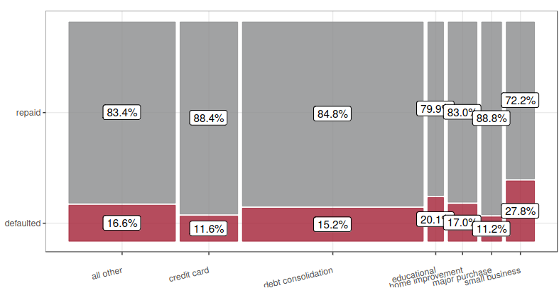
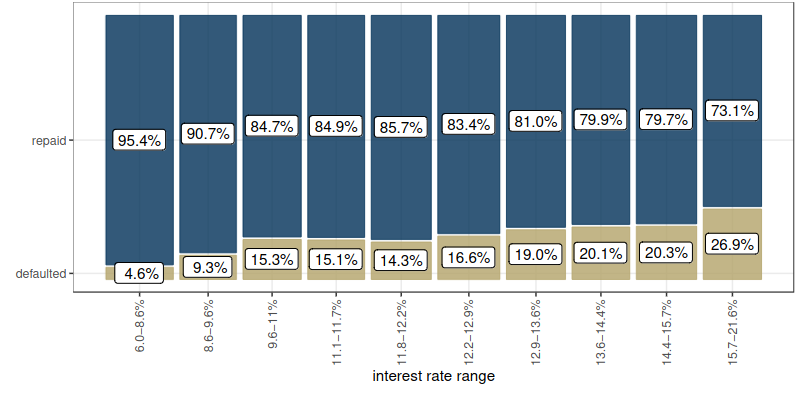

```{r setup, include=FALSE}
knitr::opts_chunk$set(echo = TRUE, message = FALSE, warning = FALSE)

if (!require(pacman)) {
  install.packages("pacman")
}


pacman::p_load(
  tidyverse, janitor, skimr,
  kableExtra, readxl, conflicted,
  GGally, ggthemes, patchwork,
  stargazer
)

options(digits = 3)
ggplot2::theme_set(ggthemes::theme_clean())

```

# **RQ1 Does default rate depend on the purpose of the loan?**

## ***SQ 1.1 Give the variables represented in each role in Figure 1***





- Explanatory: Purpose

- Response: Defaulted


## ***SQ 1.2 Fill in the blanks and circle the correct options in parentheses to complete the text summary***

```{r, include=FALSE}
loans <- readxl::read_xlsx("loans_data.xlsx")
loans |>
    select(purpose, defaulted) |>
    summarise(default = sum(defaulted),
              
              .by = purpose
              ) |>
    
    left_join( 


loans |>
    group_by(purpose) |>
    count(), by = "purpose") |>
    rename(number_of_loans = n)
```

Default rate differs somewhat by loan purpose. The highest default rate was for **debt consolidation** loans: `r 603/3597 * 100` \% of them defaulted. The lowest default rate was for **major purchase** loans: `r (437-49)/437 * 100` \% of them were repaid in full. Perhaps surprisingly, the default rate for credit card loans was `r 20.1 - 11.6` percentage points ( higher / \ovalbox{lower}) than the default rate for educational loans. In other words, educational loans defaulted at a rate `r 20.1 - 11.6` % ( \ovalbox{higher} / lower) than credit card loans.

# **RQ 2 Does the debt-to-income ratio seem to influence the interest rate borrowers receive?**

## ***SQ 2.1 For this research question, what are***

```{r, include=FALSE}
names(loans)
sapply(loans, class)
```

a. The variables?

The variables are debt to income (dti) and interest rates (int_rate). 

b. Variable types?

Both debt to income (dti) and interest rates (int_rate) are quantitative /numeric variables. 

c. Variable roles?

The interest rate (int_rate) is the response (dependent) variable. The debt to income (dti) is the explanatory (independent) variable.

d. Appropriate type of chart?

Because there are 2 numeric variables, the appropriate chart is the scatter plot, with interest rate on the y-axis and debt to income ratio on the x-axis. 

e. Appropriate summary statistic(s)?

The correlation coefficient and covariance would be useful summary statistics to quantify the degree of linear relationship between interest rates and debt to income ratio. 

## ***SQ 2.2 Chart***

```{r, fig.height=4, fig.cap='Relationship Between Interest Rates and Debt to Income'}
loans |>
    mutate(defaulted = factor(defaulted)) |>
    ggplot(aes(x = dti, y = int_rate, color = defaulted)) + 
    geom_point(alpha = 0.6) + 
    scale_color_tableau() + 
    ggthemes::theme_clean() + 
    labs(title = "Relationship Between Interest Rates and Debt to Income",
         subtitle = "Does the debt-to-income ratio seem to influence the interest rate borrowers \nreceive?", 
         x = "Debt to Income Ratio",
         y = "Interest Rates")
```

***SQ 2.3 Text summary—give a qualitative summary plus one summary statistic***

**Qualitative summary**: There is little relationship between interest rates and dent to income ratio. Note that the scatter plot is approximately flat meaning that as debt to income ratio goes up, interest rates on loans do not change significantly. 

**Quantitative summary**: The correlation coefficient between interest rates and debt to income ratio is `r cor(loans$dti, loans$int_rate)`.


# **RQ 3 How is interest rate related to FICO score?**

```{r, fig.cap = 'Chart visualizing the relationship between FICO score and interest rate on the loan. A linear model is shown in blue, together with its formula.'}

loans |>
    ggplot(aes(x = fico, y = int_rate)) + 
    geom_point() + 
    geom_smooth(method = "lm", se = FALSE) + 
    theme_bw() + 
    labs(title = "Interest Rates and FICO scores", x = "FICO score (FICO points)",
         y = "Interest Rate (as percentage of principal)") + 
    annotate(geom="text", x=800, y=0.22, 
             label="y = 48.2-0.0505x",
              color="blue")
```


## **SQ 3.1 Text summary—with qualitative and quantitative summaries (use the slope of the line)**

**Qualitative summary**: There is a notable negative correlation between FICO scores and interest rates. Specifically, when the FICO score rises by a percentage point, interest rates correspondingly go down by an average of 5.05 percentage points. This is the reason the plot has a relatively steep downwards slope.  

**Quantitative Summary**: We summarise this relationship using the correlation coefficient as there are two quantitative variables. The correlation coefficient is `r cor(loans$fico, loans$int_rate)`, indicating a relatively strong negative relationship between FICO scores and interest rates.

# **RQ 4 Can the borrower’s annual income be used to predict a loan’s monthly instalment amount?** 

## ***SQ 4.1 For this research question, what are***

a. The variables?

The variables annual income (annual_inc) and monthly instalment amount (instalment).

b. Variable types?

Annual income is a quantitative variable.

Loan instalment is also a quantitative variable. 

c. Variable roles?

In this context, monthly instalment amount is the response variable. Annual income is the explanatory or independent variable.

d. Appropriate type of chart?

Because these two variables are quantitative, the scatter plot is the most appropriate chart to visualise the data. 

```{r, fig.cap="Annual Income and Loan Instalments"}
loans |>
    ggplot(aes(x = annual_inc, y = installment)) + 
    geom_point() + 
    geom_smooth(method = "lm", se = FALSE) + 
    theme_bw() + 
    labs(title = "Annual Income and Loan Instalments", 
         x = "Annual Income, USD",
         y = "Monthly Instalment, USD") + 
    annotate(geom="text", x=1000000, y=750, label="y = 48.2-0.0505x",
              color="blue") 

```

```{r, fig.cap="Annual Income and Loan Instalments (Log Scale)"}
loans |>
    ggplot(aes(x = annual_inc, y = installment)) + 
    geom_point() + 
    geom_smooth(method = "lm", se = FALSE) + 
    theme_bw() + 
    labs(title = "Annual Income and Loan Instalments (Log Scale)", x = "Annual Income, USD (Log Scale)",
         y = "Monthly Instalment, USD") + 
    annotate(geom="text", x=1000000, y=750, label="y = 48.2-0.0505x",
              color="blue") + 
    scale_x_log10()
```

e. Appropriate summary statistic(s)?

These two are quantitative variables and hence, I use the correlation coefficient. The correlation between annual income and monthly instalments is `r cor(loans$annual_inc, loans$installment)`. 

In addition, I run regression analysis (Table 1). Here, I use both the logarithm of income and the raw income variables. 

```{r, results='asis'}
raw_model <- lm(installment ~ annual_inc, data = loans)

log_model <- lm(installment ~ log(annual_inc), data = loans)

stargazer::stargazer(raw_model, log_model, title = "Regression Analysis", type = "latex", column.labels = c("Raw Model", "Log Model"), header = FALSE)
```

To answer this research question, you could use either annual income or the natural log of annual income as the predictor. Assume you would like to use a linear model.

## **SQ 4.2 Which variable would make a better predictor and why?**

Circle the best answer a. or b. and explain in the box below.

a. Annual income.

b. \ovalbox{Natural log of annual income} and why?

The model with the natural logarithm of income as the outcome has better predictive power. looking at the adjusted R-squared,the variability in the logarithm of annual income can explain 20.1\% of the variability in monthly instalments compared to 9.8 \% explained by the model using raw annual income. 

\newpage

# **RQ 5 Does the number of times the borrower has been 30+ days late provide an indication of whether they will default?**

## ***SQ 5.1 For this research question, what are**

a. The variables?

The variables are:

- Defaulted. Did the borrower default?

- delinq_2yrs: The number of times the borrower had been 30+ days past due on a payment in the past 2 years.

b. Variable types?

- Defaulted is a categorical variable with 2 levels 0 and 1.

- delinq_2yrs: This is a quantitative discrete variable of the count of times the borrower has been 30+ days past due on a payment in the past 2 years.

c. Variable roles?

- Defaulted is the response or dependent variable.

- delinq_2yrs is the explanatory or independent variable.

d. Appropriate type of chart?

Here, we are dealing with a quantitative and categorical variable. We can use a box plot to visualize the incidence of delinquency between defaulters and non-defaulters. 

e. Appropriate summary statistic(s)?

In this case, I would compute the mean and median number of times that defaulters and non-defaulters were 30+ days past due on a payment in the past 2 years.

## ***SQ 5.2 Chart***

See Figure 6 below.

```{r, fig.cap="Defaults vs Number of Past Delinquencies"}
loans |>
    mutate(defaulted = factor(defaulted, 
                              labels = c("No", "Yes"))) |>
    ggplot(mapping = aes(x = defaulted, 
                         y = delinq_2yrs,
                         fill = defaulted)) + 
    labs(x = "Defaulted?", 
         y = "Counts of Delinquency in Last 2 Years",
         title = "Defaults vs Number of Past Delinquencies",
         subtitle = 'Non-defaulters have lower incidences of average delinquencies although there are outliers') +
    geom_boxplot(show.legend = FALSE) + 
    scale_y_log10() + 
    scale_fill_tableau()
```


## ***SQ 5.3 Table***


```{r}
loans|>
    mutate(defaulted = factor(defaulted, 
                              labels = c("Non-defaulters", "Defaulters"))) |>
    group_by(defaulted) |>
    summarise(Mean_times = mean(delinq_2yrs),
              Median_times = median(delinq_2yrs)) |>
    kbl(booktabs = TRUE, caption = "Number of Loan Delinquencies, Defaulters vs Non-defaulters") |>
    kable_classic(full_width = FALSE, 
                  latex_options = 'hold_position') |>
    footnote(general = "Non-defaulters have marginally low incidence of average delinquency")
```

## ***SQ 5.4 Text Summary***

The difference in the average delinquency rate between defaulters and non-defaulters is marginal. For instance, the median number of delinquency between the two groups is zero. However, non-defaulters show a marginally lower average number of delinquencies in the past 2 years, at 0.162 times and 0.175, respectively. 


# **RQ 6 Does the purpose of a loan seem to affect the interest rate?**

## ***SQ 6.1 For this research question, what are:***

a. The variables?

The variables are:

- Purpose (purpose).

- Interest rates (int_rate).

b. Variable types?

- Purpose (purpose) is a categorical variable with 7 levels or categories.

- Interest rate (int_rate) is a quantitative, continous variable.

c. Variable roles?

- Interest rate is the response or dependent variable.

- Purpose is the explanatory or independent variable.

d. Appropriate type of chart?

Again, given that we have a categorical and continuous variable, a box plot is suited for visualization. 

e. Appropriate summary statistic(s)?

In this case, it would be appropriate to compute the mean and median interest rates per loan purpose. 


## ***SQ 6.2 Table***

```{r}
loans|>
    mutate(defaulted = factor(purpose)) |>
    group_by(purpose) |>
    summarise(mean_interest_rates = mean(int_rate),
              median_interest_rates = median(int_rate)) |>
    arrange(desc(mean_interest_rates)) |>
    kbl(booktabs = TRUE, 
        caption = "Interest Rates by Loan Purpose") |>
    kable_classic(full_width = FALSE, 
                  latex_options = 'hold_position') |>
    footnote(general = "Small businesses have the highest interest on loans. Major Purchases have the least")
```

## ***SQ 6.3 Text summary***

The purpose of a loan has a notable relationship with interest rates. Small businesses face the highest interest rates. Major purchases are charged the lowest rates, presumably because these purchases can serve as collateral.

\newpage

# **RQ 7 Is this data set consistent with the conventional wisdom regarding interest rates and default risk?**

The conventional wisdom is that lenders charge higher interest rates for higher-risk loans, i.e. those that are more likely to default.



## ***SQ 7.1 Based on Figure 3, is this data set consistent with the conventional wisdom?***

Why or why not—as a text summary, both qualitative and quantitative, and include metadata

**Qualitative**: The figure is line with conventional wisdom. There is a significant relationship between interest rates charged on loans and the rate of interest. Specifically, loans with higher rates of interest exhibit a higher rate of default. 

**Quantitative**: In the figure, we see that loans with an interest rate of between 15.7\% and 21.6\% have a higher default rate of 26.9\%. This is in contrast with loans with an interest of between 6\% and 8.6\% that have a default rate of 4.6\%. 


