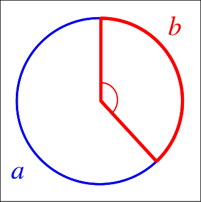

```{r setup, include=FALSE}

if(!require(pacman)){
        
        install.packages("pacman")
        
}

pacman::p_load(tidyverse, tufte)

# invalidate cache when the tufte version changes
knitr::opts_chunk$set(cache.extra = packageVersion('tufte'))
options(htmltools.dir.version = FALSE)

```


## Background

> "The scientist does not study nature because it is useful; he studies it because he delights in it, and he delights in it because it is beautiful." (Henri Poincaré)

There are many examples of natural facts that can be described in mathematical terms. Nice examples are the shape of snowflakes, the fractal geometry of romanesco broccoli or how self-similarity rules the growth of plants.


R is a tool for doing serious analysis, but not everything in life is serious. Life is also funny, and R can be used to have fun and to do beautiful things. Its graphical power can be used to produce artistic images like the one that illustrates this section, which is inspired by how plants arrange their leaves. This fact is called phyllotaxis and will serve as the basis of this project.

In this notebook, we are using the ggplot2 package. Apart from having fun, we will learn many important features of it that will be useful not only to do art but also to represent data in real-life problems. Let's start by loading the library.

## Warming up: drawing points on a circle

There are many ways to represent data with ggplot2: from simple scatter plots to more complex violin plots. The functions that start with geom_ define the type of plot. In this notebook, we will only work with geom_point() which plots points in two dimensions. We'll need a dataset with two variables; let's call them x and y.

We'll start by drawing 50 points on a circle of radius 1. As every (x, y) point should be in the unit circle, it follows that; 

x² + y² = 1. 

We can get this using the super famous Pythagorean trigonometric identity which states that;

sin²(θ) + cos²(θ) = 1 for any real number θ.

```{r, fig.width = 5, fig.height = 5}
# Create circle data to plot
t <- seq(0, 2*pi, length.out = 50)
x <- sin(t)
y <- cos(t)
df <- data.frame(t, x, y)

# Make a scatter plot of points in a circle
p <- ggplot(df, aes(x, y))
p + geom_point()
```

3. Make it harmonious with the Golden Angle

Plants arrange their leaves in spirals. A spiral is a curve which starts from the origin and moves away from the origin as it revolves around it. In the plot above all our points are the same distance from the origin. A simple way to arrange them in a spiral is to multiply x and y by a factor which increases for each point. We could use t as that factor, as it meets these conditions, but we will do something more harmonious. We will use the Golden Angle:

Golden Angle = π(3 − √5)

This number is inspired by the Golden Ratio, one of the most famous numbers in the history of mathematics. Imagine that you have a circumference and you break up it into two arcs with lengths a and b, with a>b (an arc is a portion of the circumference). There exists an angle that breaks the circle so that;

$\frac{a}{b}=\frac{(a+b)}{a}$ 

This magic angle is called the `Golden Angle`. In other words: the Golden Angle breaks up a circle so that the ratio of the big arc to the little arc is the Golden Ratio. This [image from Wikipedia](https://en.wikipedia.org/wiki/Talk:Golden_angle) illustrates the previous definition:




The Golden Angle is the angle subtended by the smaller (red) arc. Both the Golden Ratio and the Golden Angle appear in unexpected places in nature. Apart of flower petals and plant leaves, you'll find them in seed heads, pine cones, sunflower seeds, shells, spiral galaxies, hurricanes, etc.

It's time to spiralize!

```{r, fig.width = 5, fig.height = 5}
# Define the number of points
points <- 500

# Define the Golden Angle
angle <- pi * (3 - sqrt(5))

t <- (1:points) * angle
x <- sin(t)
y <-cos(t)
df <- data.frame(t, x, y)

# Make a scatter plot of points in a spiral
p <- ggplot(df, aes(x*t, y*t))
p + geom_point()
```

