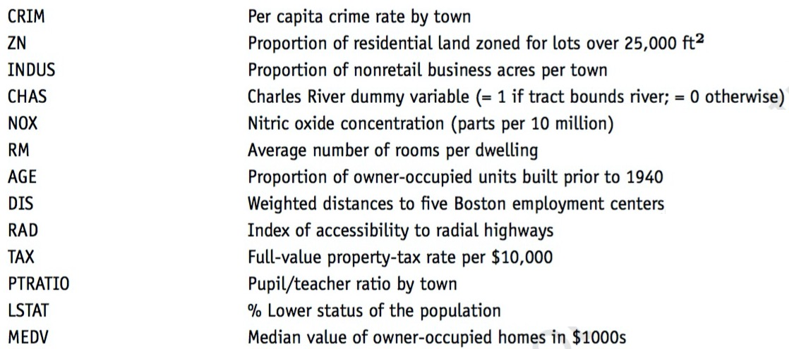

```{r setup, include=FALSE}
## Load required packages 
knitr::opts_chunk$set(echo = FALSE, warning = FALSE, message = FALSE)

if(!require(pacman)){
    install.packages("pacman")
}

pacman::p_load(tidyverse, janitor, skimr, corrplot, 
               Amelia, xtable, tidymodels)

## Set theme and digits
#theme_set(theme_few())

options(digits = 2)

## Table formatting function
formatting_function <- function(data, caption = "Table 1", 
                                full_width = FALSE){
    library(kableExtra)
    data %>% 
        kbl(booktabs = TRUE, caption = caption) %>% 
        kable_classic(full_width = full_width,
                      latex_options = "hold_position")
}
if(!require(firatheme)){
remotes::install_github("vankesteren/firatheme")}

```

\newpage

# **QUESTION ONE**

Question 1: Predicting Boston Housing Prices. (25 points) 

The file BostonHousing.csv contains information by the US Bureau of the Census concerning housing in the area of Boston, Massachusetts. The dataset includes information on 506 census-housing tracts in the Boston area. The goal is to predict the median house price in new tracts based on information such as crime rate, pollution, and number of rooms. The dataset contains 13 predictors, and the response is the median house price (MEDV). Table 1 describes each of the predictors and the response. 




## **Compute the correlation table for all variables and show which variables has the strongest positive and which variable has the strongest positive and which variable has the strongest negative correlations with the median house price (MEDV). (1 points)**


```{r, fig.width = 7}
#Q1.1
## Reading in the data 
housing <- read_csv("BostonHousing.csv")

## Get correlations between all variables
my_corr <- housing %>% 
    cor() %>% round(2)

## Create a correlation matrix
upper<- my_corr
upper[upper.tri(my_corr)]<-""
upper<-as.data.frame(upper)
upper
```

- The average number of rooms per dwelling has the highest positive correlation with median house price (0.7).

- Percent lower status of the population has the highest negative correlation with median house price (-0.74).


```{r}
## Plot the correlation matrix
housing %>% 
    cor() %>% 
    corrplot(method = "circle", 
             type = "lower",
             diag = FALSE)
```


## **Why should the data be partitioned into training and validation sets? What will the training set be used for? What will the validation set be used for? (3 points)**

We split the data into training and validation sets to allow us to train and tune a model on one set (the training set) and evaluate the model on a completely new set (the validation set) that has not been used in model development and selection. This technique allows us to select a model that would do best in the real world by limiting `overfitting`. 

The training set is useful for training and selecting appropriate machine learning model or models.

We use the validation set to approximate our model's unbiased accuracy in new settings. In other words the validation set allows us to evaluate how the model would perform given new data. 

## **Partition records into 60% for training and 40% for validation sets. Then fit a multiple linear regression to MEDV as a function of CRIM, CHAS, and RM for training sets and show the summarized regression results. Based on your regression results, make a prediction on your validation sets. Be sure to write the equation for predicting the median house price from the predictors in the model and interpret your regression results. (8 points).**

```{r}
## Q1.3
## Allows reproducibility
set.seed(134)

## Create a 60-40 split of the data
split_object <- initial_split(housing, prop = 0.6)
training_set <- split_object %>% training()
testing_set <- split_object %>% testing()
```


```{r}
##Regression of MEDV as a function of CRIM, CHAS, and RM
## MEDV as a function of CRIM, CHAS, and RM

my_first_reg <- lm(MEDV ~ CRIM + CHAS + RM, data = training_set)

summary(my_first_reg)
```

The estimated equation is as follows:

$MEDV = -30.7248 - 0.2371CRIM + 2.1048CHAS + 8.5918RM + error_term$


There is an inverse relationship between `crime` and `median house prices`. Both Charles River dummy (CHAS) and number of rooms (RM) have a positive relationship with median house prices, ceteris paribus. 

Specifically, a unit increase in crime reduces median house prices by 237.10 holding all other variables constant. A house located in the Charles river is, on average US\$ 2104.80 more expensive than a house not located there, all else remaining the same. An extra room raises prices by US\$ 8591.80 all else remaining the same. 


```{r}
## Predicting on the testing / validation test
my_first_reg_prediction <- predict(my_first_reg, newdata = testing_set)
```

## **Fit another multiple linear regression model to the median house price (MEDV) as a function of LSTAT, INDUS, and NOX for training sets and show the summarized regression results. Then, make a prediction based on this model for your validation sets. (5 points)**

```{r}
## Run a second regression
my_second_reg <- lm(MEDV ~ LSTAT + INDUS + NOX, data = training_set)

summary(my_second_reg)

## Make predictions on the second regression
my_second_reg_prediction <- predict(my_second_reg, newdata = testing_set)
```


The associated equation is as follows:

$MEDV = 32.31360 - 0.93954LSTAT - 0.14641INDUS + 6.76920NOX + error_term$

Both the proportion of lower status population`LSTAT` and proportion of non-retail businesses `INDUS` have an inverse relationship with `median house prices`. Nitrogen Oxide (`NOX`) concentration has a positive relationship with median house prices, ceteris paribus. 

Ceteris paribus, a unit increase in low status population corresponds to a reduction in median house prices by US\$ 939.54 on average. A unit increase in the proportion of non-retail businesses is associated with a rise in median house prices by an average of US\$ 146.41. Finally, a unit rise in Nitrogen Oxide corresponds to an average increase in house prices by US\$ 6769.20. 

## **Now get the accuracy metrics for these two predicted models and show their accuracy metrics respectively. Based on their accuracy metrics, select which model is the best model in terms of the accuracy metrics, and why. (8 points)**

```{r}
## Create a data frame of actual values
## And predcitions from both models
predictions <- testing_set %>% 
    select(MEDV) %>% 
    bind_cols(my_first_reg_prediction) %>% 
    bind_cols(my_second_reg_prediction) %>% 
    set_names(c("median_price", "first_reg", "second_reg"))

```

The root mean squared error for the first and second regression are as follows.

```{r}
## First regression metrics
sqrt(mean((predictions$median_price - predictions$first_reg)^2))

## Second regression 
sqrt(mean((predictions$median_price - predictions$second_reg)^2))
```
The mean absolute error is as follows.

```{r}
## mean absolute error
mean(abs(predictions$median_price - predictions$first_reg))


mean(abs(predictions$median_price - predictions$second_reg))
```

In both cases, the first model that relates median house prices with CRIM, CHAS, and RM is better because it has lower RMSE and lower MSE. Also, the first model has higher $R^{2}$ and adjusted $R^{2}$. 

```{r}
## Other metrics
glance(my_first_reg)
glance(my_second_reg)
```


