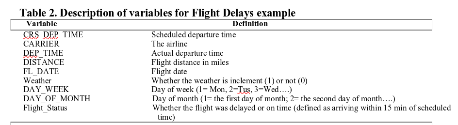

```{r setup, include=FALSE}
###################################################
knitr::opts_chunk$set(echo = FALSE, warning = FALSE, message = FALSE)

## Load required data

if(!require(pacman)){
    install.packages("pacman")
}

## Load required packages 
##################################################
pacman::p_load(tidyverse, janitor, skimr, corrplot, 
               Amelia, xtable, tidymodels, KableExtra, rpart, rpart.plot)

##################################################
## Set theme and digits

options(digits = 2)

## Table formatting function
formatting_function <- function(data, caption = "Table 1", 
                                full_width = FALSE){
    library(kableExtra)
    data %>% 
        kbl(booktabs = TRUE, caption = caption) %>% 
        kableExtra::kable_classic(full_width = full_width,
                      latex_options = "hold_position")
}

if(!require(firatheme)){remotes::install_github("vankesteren/firatheme")}

```

# **Question Three: Predicting Delayed Flights (30 points)**

The file FlightDelays.csv contains information on all commercial flights departing the Washington, DC area and arriving at New York during January 2004. For each flight, there is information on the distance of the route, the scheduled time and date of the flight, and so on. The variable that we are trying to predict is whether or not a flight is delayed (Fight_Status). Table 2 describes variables in this file.




## Partition records into 60% for training and 40% for validation sets. Fit a classification tree to the flight delay variable using all the relevant predictors in FlightDelays.csv on training sets with maximum of 8 levels and set up cp =0.001 and then plot the tree. (5 points)

Note: cp refers to complexity parameter 

```{r}
## read the data and clean names
flights <- read_csv("FlightDelays.csv") %>% clean_names()

## Split the data into training and testing set
flights_split <- initial_split(flights, prop = 0.6, strata = flight_status)


flights_training <- flights_split %>% training()
flights_testing <- flights_split %>% testing()
```

I the fit the classification tree. 

```{r}
## Fitting the regression tree on training data
flights_tree <- rpart(flight_status ~ carrier + distance + weather + day_week + day_of_month, data = flights_training, method = 'class', 
                      control = rpart.control(cp = 0.001,
                                              maxdepth = 8))
## Plotting the tree
rpart.plot(flights_tree)
```


## In the setting of decision tree, there is a technique called pruning the tree. Discuss the purpose of pruning the tree and why we may need to prune the tree. Finally, then prune 3.1. tree and plot the pruned tree. (10 points) 

Pruning is a data compression technique for reducing the size of decision trees by removing non-critical and redundant sections of the tree. The purpose of pruning is to reduce the complexity of the classifier. Pruning also helps improves predictive accuracy reducing of over-fitting. 

In this section, I prune the tree we grew in section 3 above.In pruning this tree, I raise the complexity parameter by a factor of 10 to 0.1. 

```{r}
## Prunning the tree
pruned_tree <- prune(flights_tree, cp = 0.01)

## Plot the prunned tree
rpart.plot(pruned_tree)
```


## Fit a new classification tree to the flight delay variable using all the relevant predictors on training sets, excluding the Weather predictor. Set cp=0.001 and maximum =6. Plot this new classification tree. (10 points) 

In this section, I create a new classification tree with cp = 0.001 and maximum depth of 6. I then plot the tree. 

```{r}
## Create another classification tree, cp = 0.001, depth = 6
another_flights_tree <- rpart(flight_status ~ carrier + distance + weather + day_week + day_of_month, data = flights_training, method = 'class', 
                      control = rpart.control(cp = 0.001,
                                              maxdepth = 6))

## Plot the tree
rpart.plot(another_flights_tree)
```


## Based on the tree from 3.3, do predictions for both training and validations sets and report their confusion matrix respectively. (5 points)  

I start by doing predictions on the training set and report the confusion matrix.

```{r}
## Prediction on the training set
train_prediction <- predict(another_flights_tree, type = "class")

## Confusion matrix on the training set
flights_training %>% 
    select(flight_status) %>% 
    mutate(flight_status = factor(flight_status, labels = c("delayed", "ontime"))) %>% 
    bind_cols(train_prediction) %>% 
    conf_mat(truth = flight_status, estimate = `...2`)

```

I now  do the predictions on the test set and likewise, report the confusion matrix. 

```{r}
## Prediction on the testing set
train_prediction_test <- predict(another_flights_tree, newdata = flights_testing, type = "class")

## Confusion matrix on the testing set
flights_testing %>% 
    select(flight_status) %>% 
    mutate(flight_status = factor(flight_status, labels = c("delayed", "ontime"))) %>% 
    bind_cols(train_prediction_test) %>% 
    conf_mat(truth = flight_status, estimate = `...2`)
```


