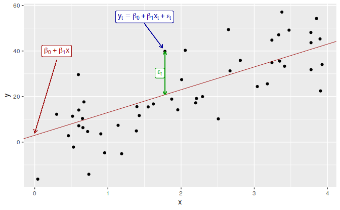
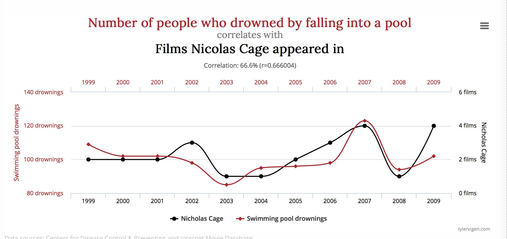

```{r setup, include=FALSE}
knitr::opts_chunk$set(echo = FALSE, cache=TRUE, warning=FALSE, message=FALSE)
options(digits=4, width=60)
library(tidyverse)
library(fable)
library(tsibble)
library(tsibbledata)
library(feasts)
library(lubridate)
library(patchwork)
us_change <- read_csv("data/uschange.csv") %>%
  mutate(Time = yearquarter(Time)) %>%
  as_tsibble(index = Time)
```

# Learning objectives

## Learning objectives

* Describe linear associations between variables
* Explain regression model assumptions
* Construct a regression model
* Forecast using regression models
* Check residual diagnostics
* Forecast using regression models with dummy variables

# The linear model with time series

## Regression models

* To **explain** 
* To **forecast**

\vspace*{0.3cm}

* Simple linear regression model(SLR)
* Multiple linear regression model (MLR)

## SLR model in thoery

Regression model allows for a linear relationship between the forecast variable $y$ and a single predictor variable $x$.

\fontsize{13}{15}\sf

\begin{block}{}\vspace*{-0.3cm}
\[
  y_t = \beta_0 + \beta_1 x_{t} + \varepsilon_t.
\]
\end{block}

* $y_t$ is the variable we want to predict: the ``response`` variable
* Each $x_{t}$ is numerical and is called a ``predictor``
* $\beta_0$ and $\beta_1$ are regression coefficients

## SLR model in practice
\fontsize{13}{15}\sf

In practice, of course, we have a collection of observations but we do not know the values of the coefficients $\hat\beta_0$, $\hat\beta_1$. 
These need to be estimated from the data.

\begin{block}{}\vspace*{-0.3cm}
\[
  y_t = \hat\beta_0 + \hat\beta_1 x_{t}.
\]
\end{block}

* $y_t$ is the ``response`` variable
* Each $x_{t}$ is a ``predictor``
* $\hat\beta_0$ is the estimated intercept
* $\hat\beta_1$ is the estimated slope

## What is the best fit

```{r SLR, fig.align='center'}

```

* There are many ways that a straight line can be laid on the scatter
* Best known criterion is called Ordinary Least Squares(OLS)

## Estimation of the model

That is, we find the values of $\beta_0$ and $\beta_1$ which minimize

\begin{block}{}\vspace*{-0.3cm}
\[
  \sum_{i=1}^N e_{i}^2 = \sum_{i=1}^N (y_{i} - \beta_{0} - \beta_{1}x_{i})^2. 
\]
\end{block}

* This is called *least squares* estimation because it gives the least value of the sum of squared errors. 
* Finding the best estimates of the coefficients is often called *fitting* the model to the data. 
* We refer to the *estimated* coefficients using the notation $\hat\beta_{0},\hat\beta_{1}$.

## Example: US consumption expenditure

\fontsize{11}{13}\sf

```{r ConsInc, echo=TRUE, fig.height=3.5}
us_change %>%
  gather("Measure", "Change", Consumption, Income) %>%
  autoplot(Change) +
  ylab("% change") + xlab("Year")
```

## Example: US consumption expenditure

```{r ConsInc2, echo=FALSE}
us_change %>%
  ggplot(aes(x=Income, y=Consumption)) +
    ylab("Consumption (quarterly % change)") +
    xlab("Income (quarterly % change)") +
    geom_point() +
    geom_smooth(method="lm", se=FALSE)
```

## Example: US consumption expenditure

\fontsize{9}{9}\sf

```{r, echo=TRUE}
fit_cons <- us_change %>%
  model(lm = TSLM(Consumption ~ Income))
report(fit_cons)
```

## Multiple regression

* In multiple regression there is one variable to be forecast and several predictor variables.
* The basic concept is that we forecast the time series of interest $y$ assuming that it has a linear relationship with other time series $x_1$, $x_2$, ...., $x_K$
* We might forecast daily A&E attendnace  $y$ using temperature   $x_1$ and GP visits $x_2$ as predictors.

## How many variable can we add?

You can add as many as you want but be aware of:

* Overfitting
* Multicollinearity

## Multiple regression and forecasting

\fontsize{13}{15}\sf

\begin{block}{}\vspace*{-0.3cm}
\[
  y_t = \beta_0 + \beta_1 x_{1,t} + \beta_2 x_{2,t} + \cdots + \beta_kx_{k,t} + \varepsilon_t.
\]
\end{block}

* $y_t$ is the variable we want to predict: the ``response`` variable
* Each $x_{j,t}$ is numerical and is called a ``predictor``.
 They are usually assumed to be known for all past and future times.

<!-- * The coefficients $\beta_1,\dots,\beta_k$ measure the effect of each predictor after taking account of the effect of all other predictors in the model. -->

<!-- That is, the coefficients measure the **marginal effects**. -->

* $\varepsilon_t$ is a white noise error term

## Estimation of the model

We find the values of $\hat\beta_{0},\dots,\hat\beta_{k}$ which minimize

$$ 
\sum_{i=1}^N e_{i}^2 = \sum_{i=1}^N (y_{i} - \beta_{0} - \beta_{1}x_{1,i} - \cdots - \beta_{k} x_{k,i})^2. 
$$

* This is called *least squares* estimation because it gives the least value of the sum of squared errors
* Finding the best estimates of the coefficients is often called *fitting* the model to the data
* We refer to the *estimated* coefficients using the notation $\hat\beta_{0},\dots,\hat\beta_{k}$.

## Useful predictors in linear regression

**Linear trend**
\[
  x_t = t
\]

* $t=1,2,\dots,T$
* Strong assumption that trend will continue.
* use special function `trend()`

**Seasonality**

* Seasinality will be considered based on the interval of index
* use special fucntion `season()`

## Example: US consumption expenditure

```{r MultiPredictors, echo=FALSE}
us_change %>%
  gather("Measure", "Change", Consumption, Income, Production, Savings, Unemployment) %>%
  ggplot(aes(x = Time, y = Change, colour = Measure)) +
  geom_line() +
  facet_grid(vars(Measure), scales = "free_y") +
  ylab("") + xlab("Year") +
  guides(colour="none")
```

## Example: US consumption expenditure

```{r ScatterMatrix, echo=FALSE}
us_change %>%
  as_tibble() %>%
  select(-Time) %>%
  GGally::ggpairs()
```

## Example: US consumption expenditure

\fontsize{7.4}{7.4}\sf

```{r usestim, echo=TRUE}
fit_consMR <- us_change %>%
  model(lm = TSLM(Consumption ~ Income + Production + Unemployment + Savings))
report(fit_consMR)

```

<!-- ## Example: US consumption expenditure -->

<!-- ```{r usfitted1, echo=FALSE} -->
<!-- augment(fit_consMR) %>% -->
<!--   ggplot(aes(x = Time)) + -->
<!--   geom_line(aes(y = Consumption, colour = "Data")) + -->
<!--   geom_line(aes(y = .fitted, colour = "Fitted")) + -->
<!--   xlab("Year") + ylab("") + -->
<!--   ggtitle("Percentage change in US consumption expenditure") + -->
<!--   guides(colour=guide_legend(title="")) -->
<!-- ``` -->

<!-- ## Example: US consumption expenditure -->

<!-- ```{r usfitted2, echo=FALSE, message=FALSE, warning=FALSE} -->
<!-- augment(fit_consMR) %>% -->
<!--   ggplot(aes(x=.fitted, y=Consumption)) + -->
<!--     geom_point() + -->
<!--     xlab("Fitted (predicted values)") + -->
<!--     ylab("Data (actual values)") + -->
<!--     ggtitle("Percentage change in US consumption expenditure") + -->
<!--     geom_abline(intercept=0, slope=1) -->
<!-- ``` -->

<!-- ## Example: US consumption expenditure -->

<!-- ```{r, echo=TRUE} -->
<!-- augment(fit_consMR) %>% -->
<!--   gg_tsdisplay(.resid, plot_type="hist") -->
<!-- ``` -->

# Evaluating the regression model 

##  Multiple regression and forecasting

For forecasting purposes, we require the following assumptions:

* $\varepsilon_t$ are uncorrelated and zero mean

* $\varepsilon_t$ are uncorrelated with each $x_{j,t}$.
\pause

It is **useful** to also have $\varepsilon_t \sim \text{N}(0,\sigma^2)$ when producing prediction intervals or doing statistical tests.

## Residual diagnostics

There are a series of plots that should be produced in order to check different aspects of the fitted model and the underlying assumptions.

1. check if residuls are uncorrelated using `ACF`
2. Check if residuals are normally distributed

## Residual scatterplots

Useful for spotting outliers and whether the linear model was
appropriate.

* Scatterplot of residuals $\varepsilon_t$ against each predictor $x_{j,t}$.

* Scatterplot residuals against the fitted values $\hat y_t$

* Expect to see scatterplots resembling a horizontal band with
no values too far from the band and no patterns such as curvature or increasing spread.

## Example: US consumption expenditure

```{r scatterplot-residuals, options}
df <- left_join(us_change, residuals(fit_consMR), by = "Time")
p1 <- ggplot(df, aes(x=Income, y=.resid)) +
  geom_point() + ylab("Residuals")
p2 <- ggplot(df, aes(x=Production, y=.resid)) +
  geom_point() + ylab("Residuals")
p3 <- ggplot(df, aes(x=Savings, y=.resid)) +
  geom_point() + ylab("Residuals")
p4 <- ggplot(df, aes(x=Unemployment, y=.resid)) +
  geom_point() + ylab("Residuals")
(p1 | p2) / (p3 | p4)
```

## Residual patterns

* If a plot of the residuals vs any predictor in the model shows a pattern, then the relationship is nonlinear.

* If a plot of the residuals vs any predictor **not** in the model shows a pattern, then the predictor should be added to the model.

* If a plot of the residuals vs fitted values shows a pattern, then there is heteroscedasticity in the errors. (Could try a transformation.)

# Selecting predictors

## Comparing regression models

Computer output for regression will always give the $R^2$ value. This is a useful summary of the model.

* It is equal to the square of the correlation between $y$ and $\hat y$.
* It is often called the ``coefficient of determination''.
* It can also be calculated as follows:
$R^2 = \frac{\sum(\hat{y}_t - \bar{y})^2}{\sum(y_t-\bar{y})^2}$

* It is the proportion of variance accounted for (explained) by the predictors.

## Comparing regression models
\fontsize{13}{15}\sf

However \dots

* $R^2$  does not allow for `degrees of freedom`.

* Adding *any* variable tends to increase the value of $R^2$, even if that variable is irrelevant.
\pause

To overcome this problem, we can use *adjusted $R^2$*:

\begin{block}{}
\[
\bar{R}^2 = 1-(1-R^2)\frac{T-1}{T-k-1}
\]
where $k=$ no.\ predictors and $T=$ no.\ observations.
\end{block}

\pause

\begin{alertblock}{Maximizing $\bar{R}^2$ is equivalent to minimizing $\hat\sigma^2$.}
\centerline{$\displaystyle
\hat{\sigma}^2 = \frac{1}{T-k-1}\sum_{t=1}^T \varepsilon_t^2$
}
\end{alertblock}

## Cross-validation

1. Remove observation $t$ from the data set, and fit the model using the remaining data. Then compute the error for the omitted observation

2. Repeat step 1 for $t=1,...,T$

3. Compute the MSE from errors obtained in 1. We shall call this the CV

## Akaike's Information Criterion

\begin{block}{}
\[
\text{AIC} = -2\log(L) + 2(k+2)
\]
\end{block}
where $L$ is the likelihood and $k$ is the number of predictors in the model.

* This is a \emph{penalized likelihood} approach.
* \emph{Minimizing} the AIC gives the best model for prediction.
* AIC penalizes terms more heavily than $\bar{R}^2$.
* Minimizing the AIC is asymptotically equivalent to minimizing MSE via leave-one-out cross-validation.

## Corrected AIC

For small values of $T$, the AIC tends to select too many predictors, and so a bias-corrected version of the AIC has been developed.

\begin{block}{}
\[
\text{AIC}_{\text{C}} = \text{AIC} + \frac{2(k+2)(k+3)}{T-k-3}
\]
\end{block}

As with the AIC, the AIC$_{\text{C}}$ should be minimized.

## Comparing regression models
\fontsize{12}{14}\sf

```{r, echo=TRUE}
glance(fit_consMR) %>%
  select(r_squared, adj_r_squared, AIC, AICc, CV)
```

## Choosing regression variables

**Best subsets regression**

* Fit all possible regression models using one or more of the predictors.

* Choose the best model based on one of the measures of predictive ability (CV, AIC, AICc).

## Choosing regression variables

**Backwards stepwise regression**

* Start with a model containing all variables.
* Try subtracting one variable at a time. Keep the model if it
has lower CV or AICc.
* Iterate until no further improvement.
* You can also do forward stepwise

# Forecasting with regression

## Ex-ante versus ex-post forecasts

 * *Ex ante forecasts* are made using only information available in advance.
    - require forecasts of predictors
 * *Ex post forecasts* are made using later information on the predictors.
    - useful for studying behaviour of forecasting models.

 * trend, seasonal and calendar variables are all known in advance, so these don't need to be forecast.

## Scenario based forecasting

 * Assumes possible scenarios for the predictor variables
 * Prediction intervals for scenario based forecasts do not include the uncertainty associated with the future values of the predictor variables.

<!-- ## Building a predictive regression model {-} -->

<!--  * If getting forecasts of predictors is difficult, you can use lagged predictors instead. -->

<!--  \begin{block}{}\vspace*{-0.3cm} -->
<!-- \[ -->
<!--   beta_0+\beta_1x_{1,t-h}+\dots+\beta_kx_{k,t-h}+\varepsilon_{t}. -->
<!-- \] -->
<!-- \end{block} -->

<!--  * A different model for each forecast horizon $h$. -->

## US Consumption
\fontsize{10}{11}\sf

```{r usconsumptionf, echo=TRUE}
fit_consBest <- us_change %>%
  model(
    TSLM(Consumption ~ Income + Savings + Unemployment)
  )

down_future <- new_data(us_change, 4) %>%
  mutate(Income = -1, Savings = -0.5, Unemployment = 0)
fc_down <- forecast(fit_consBest, new_data = down_future)

up_future <- new_data(us_change, 4) %>%
  mutate(Income = 1, Savings = 0.5, Unemployment = 0)
fc_up <- forecast(fit_consBest, new_data = up_future)
```

## US Consumption
\fontsize{10}{10}\sf

```{r usconsumptionf2, echo=TRUE, fig.height=3.5}
us_change %>% autoplot(Consumption) +
  ylab("% change in US consumption") +
  autolayer(fc_up, series = "increase") +
  autolayer(fc_down, series = "decrease") +
  guides(colour = guide_legend(title = "Scenario"))
```

# Correlation, causation and forecasting

## Correlation does not imply causation

```{r, fig.align='center'}

```

## Correlation is not causation

* When $x$ is useful for predicting $y$, it is not necessarily causing $y$.

* e.g., predict number of drownings $y$ using number of ice-creams sold $x$.

* Correlations are useful for forecasting, even when there is no causality.

* Better models usually involve causal relationships (e.g., temperature $x$ and people $z$ to predict drownings $y$).

## Multicollinearity

In regression analysis, multicollinearity occurs when:

*  Two  predictors are highly  correlated (i.e., the correlation between them is close to $\pm1$).
* A linear combination of some of the predictors is highly correlated  with another predictor.
*  A linear combination of one subset of predictors is highly correlated with a linear combination of another
  subset of predictors.

<!-- ## Multicollinearity -->

<!-- If multicollinearity exists\dots -->

<!-- * the numerical estimates of coefficients may be wrong (worse in Excel than in a statistics package) -->
<!-- * don't rely on the $p$-values to determine significance. -->
<!-- * there is no problem with model *predictions* provided the predictors used for forecasting are within the range used for fitting. -->
<!-- * omitting variables can help. -->
<!-- * combining variables can help. -->

<!-- ## Outliers and influential observations -->

<!-- **Things to watch for** -->

<!-- * *Outliers*: observations that produce large residuals. -->
<!-- * *Influential observations*: removing them would markedly change the coefficients.  (Often outliers in the $x$ variable). -->
<!-- * *Lurking variable*: a predictor not included in the regression but which has an important effect on the response. -->
<!-- * Points should not normally be removed without a good explanation of why they are different. -->

## Modern regression models

* Suppose instead of 3 regressor we had 44.
    * For example, 44 predictors leads to 18 trillion possible models!
* Stepwise regression cannot solve this problem due to the number of variables.
* We need to use the family of Lasso models: lasso, ridge, elastic net
   * watch out for a series of blogs on this in coming weeks

# Some useful predictors for linear models

## Dummy variables

\begin{textblock}{6}(0.4,1.5)
If a categorical variable takes only two values (e.g., `Yes'
or `No'), then an equivalent numerical variable can be constructed taking value 1 if yes and 0 if no. This is called a \textbf{dummy variable}.
\end{textblock}

\placefig{7.7}{1.}{width=5cm}{dummy2}

## Dummy variables

\begin{textblock}{5}(0.4,1.5)
If there are more than two categories, then the variable can
be coded using several dummy variables (one fewer than the total number of categories).

\end{textblock}

\placefig{5.5}{1.5}{width=7.3cm}{dummy3}

<!-- ## Beware of the dummy variable trap! -->

<!-- * Using one dummy for each category gives too many dummy variables! -->

<!-- * The regression will then be singular and inestimable. -->

<!-- * Either omit the constant, or omit the dummy for one category. -->

<!-- * The coefficients of the dummies are relative to the omitted category. -->

## Uses of dummy variables

\fontsize{13}{15}\sf

**Seasonal dummies**

* For quarterly data: use 3 dummies
* For monthly data: use 11 dummies
* For daily data: use 6 dummies

\pause

**Outliers**

* If there is an outlier, you can use a dummy variable to remove its effect.

\pause

**Public holidays**

* For daily data: if it is a public holiday, dummy=1, otherwise dummy=0.

## Intervention variables
\fontsize{12}{13}\sf
**Spikes**

* Equivalent to a dummy variable for handling an outlier.
\pause

**Steps**

* Variable takes value 0 before the intervention and 1 afterwards.
\pause

**Change of slope**

* Variables take values 0 before the intervention and values $\{1,2,3,\dots\}$ afterwards.

* this could be also handled using `trend()`

##  Include any special event using dummies

* Christmas Eve: if Christmas Eve, $v_t=1$, $v_t=0$ otherwise
* New year's Day: if New year's Day, $v_t=1$, $v_t=0$ otherwise.
* and more: Ramadan and Chinese new year, school holiday, etc

## lag and lead variables

* Lagged values of a predictor:
    * Create new variables by shifting the existing variable backwards
* Lead values of a predictor:
    * Create new variables by shifting the existing variable forwards

Example: $x$ is advertising which has a delayed effect

\begin{align*}
  x_{1} &= \text{advertising for previous month;} \\
  x_{2} &= \text{advertising for two months previously;} \\
        & \vdots \\
  x_{m} &= \text{advertising for $m$ months previously.}
\end{align*}

## Interactions

For example, sometimes the effect of a partiucluar event might be different if it is on a weekend or a week day or its efefct might be different in each shift:

* you need to introduce an interaction variable
* you can use a new dummy as : `v1*v2`


# Lab Session 9
## Lab Session 9
\fontsize{11}{12}\sf
Given the daily A&E time series, we want to develop a regression model that takes into account temperature, and daily seasonality:

1. Import the temperature data `temp` from the project directory
2. Join them to daily data set you have created before
3. Check the linear relationship between daily admission and temperature
4. Split the data into train and test
5. Train data using different regression models by addition different predictors
6. Produce forecast
7. Calculate point forecast accuracy
