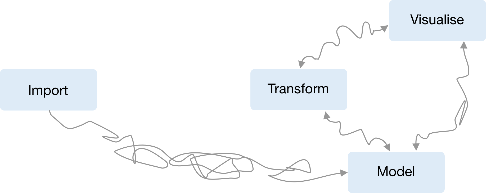
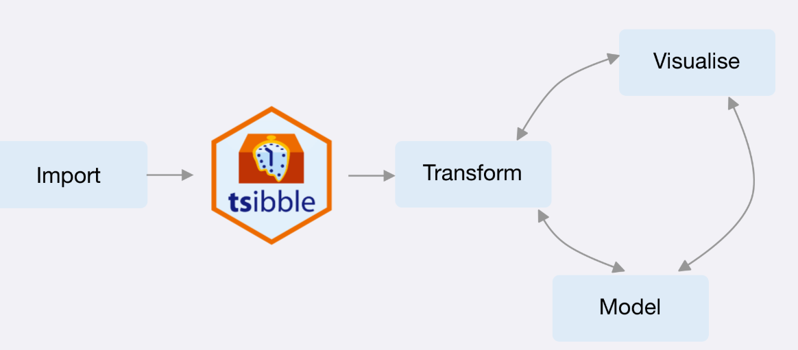

```{r setup, include=FALSE}
knitr::opts_chunk$set(echo = TRUE, cache=TRUE)
library(dplyr)
library(ggplot2)
library(fable)
library(tsibble)
library(feasts)
library(lubridate)
library(tsibbledata)
library(readr)
options(width=50)
```

# Learning outcomes
## Learning outcomes

You should be able to:

1. Create `tsibble` objects in R to work with time series data
2. Use `tsibble` functions to prepare data for time series analysis \& forecasting
3. Work with `tsibble` and tidyverse functions

# Time series in R

## Time series

A `time series` can be thought of as a list of numbers (the measurements), along with some information about what times those numbers were recorded (the index). This information can be stored as an object in R.

## Time series data

  - Four-yearly Olympic winning times
  - Annual Google profits
  - Quarterly Australian beer production
  - Monthly rainfall
  - Weekly retail sales
  - Daily IBM stock prices
  - Hourly electricity demand
  - 5-minute freeway traffic counts
  - Time-stamped stock transaction data

## Class packages
\fontsize{13}{14}\sf

```r
# Data manipulation and plotting functions
library(tidyverse)
# Time series manipulation
library(tsibble)
# Forecasting functions
library(fable)
# Time series graphics and statistics
library(feasts)
# Tidy time series data
library(tsibbledata)
```

\pause

```{r}
# All of the above and more
library(fpp3)
```

##  Tidyverse

```{r tidyr1,fig.align='center', out.width="100%",echo=FALSE}
knitr::include_graphics("figs/tidy-model.png")
```

##  Time series objects in R for forecasting

* does not work with `ts(), zoo(), xts(), etc`
* difficult to work with tidyverse

```{r tsverse,fig.align='center', out.width="100%",echo=FALSE}

```

## Features of data

* heterogeneous data types
* irregular time interval
* multiple measured variables
* multiple grouping variables

## The `key` to many time series

* Most time series can be naturally disaggregated using a series of factors known as keys
* These keys are used to uniquely identify separate time series, each of which can be modelled separately.
* This structure allows batch time series analysis & forecasting to be applied across many time series.
* Estimating multiple models is a key feature 


## Tsibble package

It defines tidier data for temporal analysis

```{r tsibbleverse,fig.align='center', out.width="100%",echo=FALSE}

```

## `tsibble` objects

**In tsibble:**

  + An index: time information about the observation
  + Measured variable(s): numbers of interest
  + Key variable(s): set of variables that define observational units over time

* It works with tidyverse functions.

## The `tsibble` index

Common time index variables can be created with these functions:

```{r tstable2, echo=FALSE}
tribble(
  ~ `Frequency`, ~ Function,
  "Annual", "start:end",
  "Quarterly", "yearquarter()",
  "Monthly", "yearmonth()",
  "Weekly", "yearweek()",
  "Daily", "as_date(), ymd()",
  "Sub-daily", "as_datetime()"
) %>%
  knitr::kable(booktabs=TRUE)
```

<!-- ## Seasonal periods -->

<!-- \begin{tabular}{lrl} -->
<!-- \bf Type of data & \hspace*{1.95cm}\bf frequency                 & \bf start example\hspace*{0.25cm} \\ -->
<!-- \midrule -->
<!-- Annual           & \only<2->{1}                                  & \only<3->{1995}\\ -->
<!-- Quarterly        & \only<4->{4}                                  & \only<5->{c(1995,2)}\\ -->
<!-- Monthly          & \only<6->{12}                                 & \only<7->{c(1995,9)}\\ -->
<!-- Daily            & \only<8->{7 \emph{or} 365.25}                 & \only<9->{1 \emph{or} c(1995,234)} \\ -->
<!-- Weekly           & \only<10->{52.18}                             & \only<11->{c(1995,23)}\\ -->
<!-- Hourly           & \only<12->{24 \emph{or} 168 \emph{or} 8,766}  & \only<13->{1}\\ -->
<!-- Half-hourly      & \only<14->{48 \emph{or} 336 \emph{or} 17,532} & \only<15>{1} -->
<!-- \end{tabular} -->

# Example: create and work with `tsibble`

## Steps to create a tsibble

```{r tidy_step, fig.align='center',echo=FALSE, out.width='99%'}
knitr::include_graphics("figs/tsibble-pipeline.jpg")
```

## Read a csv file {-}
\fontsize{10}{11}\sf

quarterly overnight trips across Australia

```{r tourism1}
tourism <- readxl::read_excel("data/tourism.xlsx")
```
```{r tourism1a, dependson="tourism1", echo=FALSE}
tourism
```

## Check duplicates {-}
\fontsize{10}{11}\sf

```{r tourism1d, echo=TRUE, eval=TRUE}
tourismd <- tourism %>% duplicated()
sum(tourismd)
#are_duplicated()
#tourism %>% distinct()
```

## Change index to `yearquarter`  {-}
\fontsize{10}{11}\sf

```{r tourism2}
tourism <- tourism %>%
  mutate(Quarter = yearquarter(Quarter))
```

```{r tourism2a, dependson="tourism2", echo=FALSE}
tourism
```

## Craete a tsibble {-}
\fontsize{10}{11}\sf

```{r tourism3}
tourism <- tourism %>% 
  as_tsibble(
    index = Quarter,
    key = c(Region, State, Purpose)
  )
```

```{r tourism3a, dependson="tourism3", echo=FALSE}
tourism
```

## Check gaps {-}
\fontsize{10}{11}\sf

```{r tourism3gap, eval=FALSE}
tourism %>% has_gaps()
tourism %>% count_gaps()
tourism %>% scan_gaps()
tourism %>% fill_gaps(Trips=0L)
```

## `tsibble` objects

\fontsize{10}{11.3}\sf

```{r, echo = TRUE}
tourism
```

\only<2->{\begin{textblock}{1.1}(2.1,3.7)
\begin{alertblock}{}\fontsize{10}{10}\sf Index\phantom{dg}\end{alertblock}
\end{textblock}}
\only<3->{\begin{textblock}{5.6}(3.65,3.7)
\begin{alertblock}{}\fontsize{10}{10}\sf Keys\phantom{dg}\end{alertblock}
\end{textblock}}
\only<4-5>{\begin{textblock}{1.5}(9.75,3.7)
\begin{alertblock}{}\fontsize{10}{10}\sf Measure\phantom{dg}\end{alertblock}
\end{textblock}}

\only<5>{\begin{textblock}{3}(9,5)
\begin{block}{}\fontsize{10}{10}\sf Domestic visitor nights in thousands by state/region and purpose.\phantom{dg}\end{block}
\end{textblock}}

## Working with `tsibble` objects {-}
\fontsize{12}{14}\sf

We can use the `filter()` function to select rows.

\fontsize{8}{10}\sf

```{r tourism4}
tourism %>%
  filter(Purpose == "Business")
```

## Working with `tsibble` objects {-}
\fontsize{12}{14}\sf

We can use the `select()` function to select columns.

\fontsize{8}{10}\sf

```{r tourism5}
tourism %>%
  filter(Purpose == "Business") %>% 
  select(Region,Trips)
```

## Working with `tsibble` objects {-}
\fontsize{12}{14}\sf

- We can use `group_by()` function to group over keys.
    - We can also do it with: `group_by_key()`
- We can use the `summarise()` function to summarise over keys.

\fontsize{8}{10}\sf

```{r tourism6}
tourism %>%
  group_by(Region, Purpose) %>%
  summarise(Trips = mean(Trips)) %>% 
  ungroup()
```

## Working with `tsibble` objects {-}
\fontsize{12}{14}\sf

- We can use `index_by()` function to group over index
- We can use the `summarise()` function to summarise over index.

\fontsize{8}{10}\sf

```{r tourism7}
tourism %>%
index_by(Quarter) %>% 
  summarise(total_trips = sum(Trips))
```

## Working with `tsibble` objects {-}
\fontsize{12}{14}\sf

We can use the `mutate()` function to create new variables.

\fontsize{8}{10}\sf

```{r tourism9}
tourism %>%
  mutate(year = year(Quarter)) -> m1
```

```{r tourism9a, echo=FALSE}
m1
```

```{r narrow, include=FALSE}
options(width = 60)
```

# Lab Session 1

## Lab Session 1
\fontsize{12}{13}\sf

 1. Read [`ae_uk.csv`] into R
 
 2. Check duplication
 
 3. Create a tsibble object! Is the `index` a regular interval? If the answer is no, Which argument do you need to specify? 

 4. Create a new tsibble which has a regular interval of `30 minutes`, and has total admissions per hour for each day and type of gender and injury_type.
 
 5. Is there any gap in data? you can use `has_gaps()`, `count_gaps()` and `scap_gaps()`
 
 6. Create total hourly, daily, weekly, monthly and quarterly admissions (ignoring keys)

