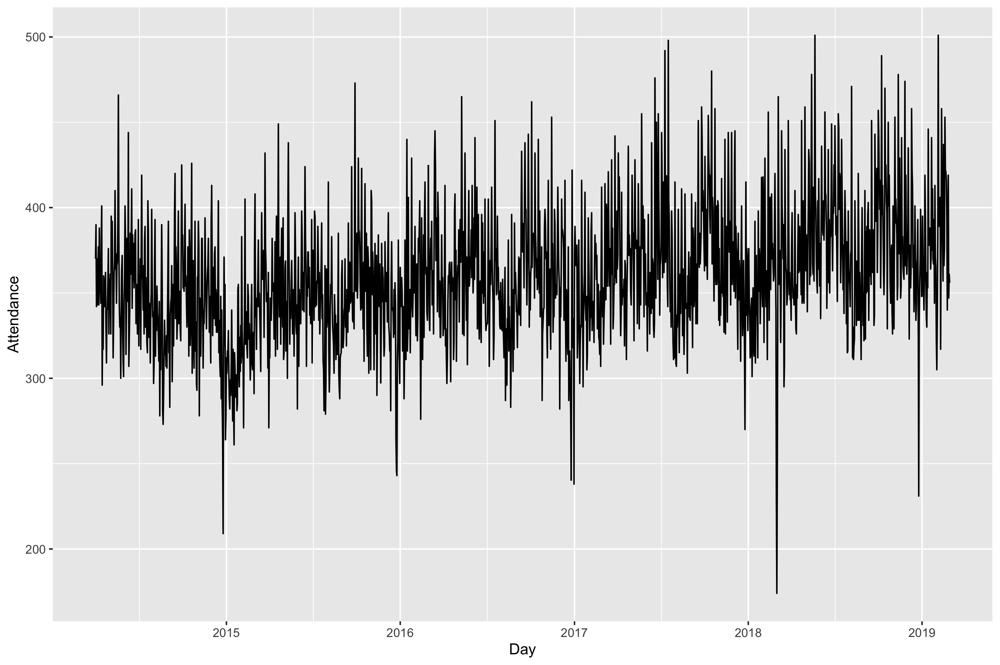
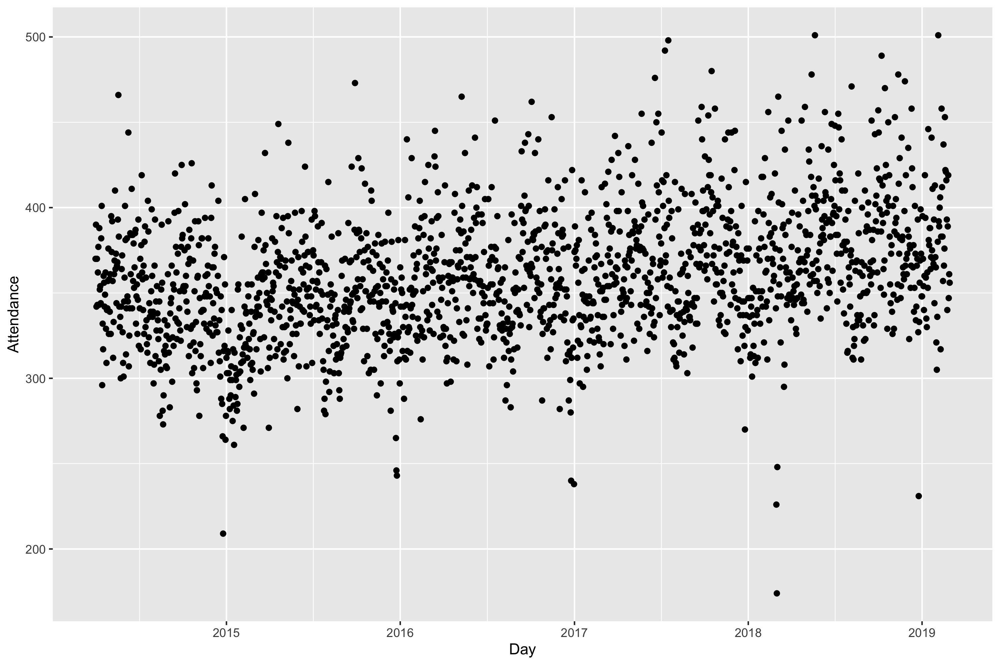
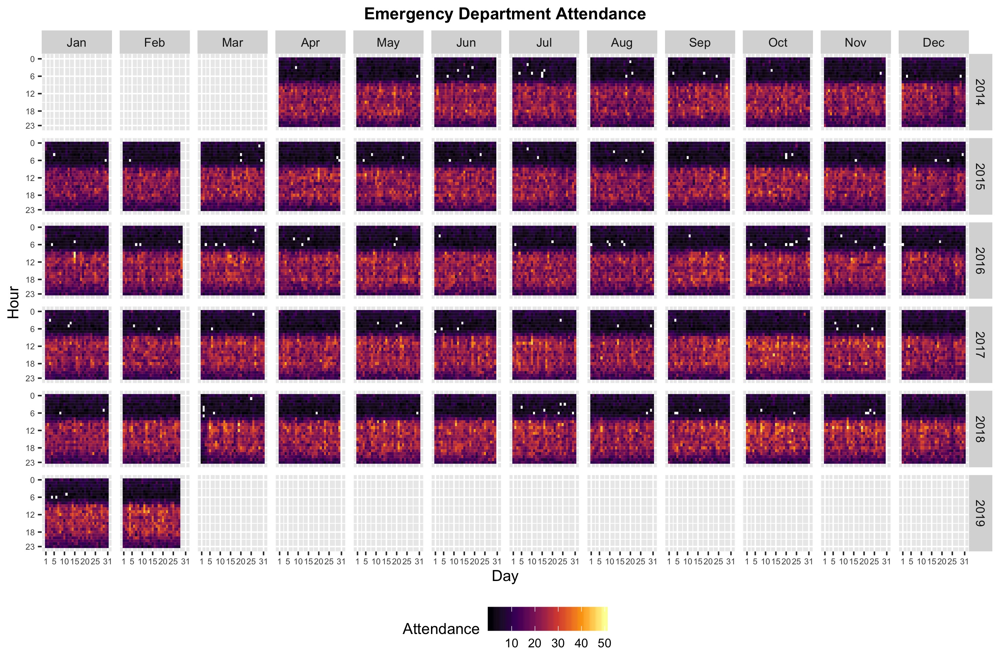

```{r setup, include=FALSE}
knitr::opts_chunk$set(echo = TRUE, cache=TRUE, warning = FALSE)
library(dplyr)
library(ggplot2)
library(fable)
library(tsibble)
library(feasts)
library(lubridate)
library(tsibbledata)
library(readr)
options(width=50)
elecequip <- as_tsibble(fpp2::elecequip)
```

# Learning outcome
## Learning outcome

You should be able to:

1.	Create time series graphics
2.	Identify key patterns in time series data


# Time series Patterns

## Key components of time series

- Level
- Trend
- Seasonal/cycle pattern
- Autocorrelation
- Unpredictable patterns/Noise

## Time series patterns

Level
  : The *level* of a time series describes the center of the series at any point.

Trend
  : pattern exists when there is a increase or decrease in the data.

Seasonal
  : A consistent pattern over a fixed period of time (e.g., every 24 hours you have the same shape (daily seasonal pattern), every seven days you have the same shape (weekly seasonal pattern), etc).

Cyclic
  : pattern exists when data exhibit rises and falls that are \emph{not of fixed period} (duration usually of at least 2 years).

# Time plots

## Time plots

```{r level, out.width="100%", fig.align='center', echo=FALSE}
library(patchwork)
set.seed(2023)
Quarter <- seq.Date(
  from = as.Date("2011-01-01"),
  to   = as.Date("2022-12-01"),
  by   = "quarters"
)
ts_demand <- tidyr::tibble(
  Quarter=Quarter, Level = rep(50,length(Quarter)),
randomness = round(rnorm(length(Quarter),0,15)),
`Level with randomness` = Level+randomness)
p_level <- ggplot(ts_demand, aes(x= Quarter, y= Level))+
  geom_point()+
  geom_line()+
     theme_classic()+
  theme(axis.text.x = element_text(angle = 90, vjust = 0.5))+
  labs(y="Demand")

p_level_noise <- ggplot(ts_demand, aes(x= Quarter, y= `Level with randomness`))+
  geom_point()+
  geom_line()+
  geom_line(aes(y=Level, linetype="Level"),color="red", linewidth=1)+
  scale_linetype_manual(values = c("Level"=2))+
  theme_classic()+
  theme(axis.text.x = element_text(angle = 90, vjust = 0.5))+
  labs(y="Demand",linetype=NULL)

(p_level/p_level_noise)
```


## Time plots

\small

```{r, echo=TRUE, fig.height=3}
ansett %>%
  filter(Airports=="MEL-SYD", Class=="Economy") %>%
  autoplot(Passengers)
```

## Time plots

\small

```{r a10-plot, echo=TRUE, dependson="a10", fig.height=2.5}
PBS %>% filter(ATC2 == "A10") %>%
  summarise(Cost = sum(Cost)/1e6) %>% autoplot(Cost) +
  ylab("$ million") + xlab("Year") +
  ggtitle("Antidiabetic drug sales")
```

<!-- ## Time plots  -->
<!-- \fontsize{13}{15}\sf -->

<!-- ```{r, fig.height=2.5} -->
<!-- #Quarterly Australian Beer Production -->
<!-- beer <- aus_production %>% -->
<!--   select(Quarter, Beer) %>% -->
<!--   filter(year(Quarter) >= 1992) -->
<!-- beer %>% autoplot(Beer) -->
<!-- ``` -->

## Are time plots best?

```{r tp2, fig.align='center', out.width="100%", echo=FALSE}

```

## Are time plots best?

```{r tp3, fig.align='center', out.width="100%", echo=FALSE}

```

## Are time plots best?

```{r tp1, fig.align='center', out.width="100%", echo=FALSE}

```

# Seasonal plots

## Seasonal plots

\footnotesize

```{r gg_s, echo=TRUE}
new_production <- aus_production %>%
  filter(year(Quarter) >= 1992)
new_production %>% gg_season(Beer, labels = "both")+
  ylab("$ million") +
  ggtitle("Seasonal plot: antidiabetic drug sales")
```

## Seasonal plots

  * Data plotted against the individual "seasons" in which the data were observed.  (In this case a "season" is a month.)
  * Something like a time plot except that the data from each season are overlapped.
  * Enables the underlying seasonal pattern to be seen more clearly, and also allows any substantial departures from the seasonal pattern to be easily identified.
  * In R: `gg_season()`

<!-- ## Seasonal polar plots -->

<!-- \small -->

<!-- ```{r, fig.height=6, out.width="7.5cm"} -->
<!-- a10 %>% gg_season(polar = TRUE) + -->
<!--   ylab("$ million") -->
<!-- ``` -->

## Seasonal subseries plots

\small

```{r, echo=TRUE, dependson='gg_s'}
new_production %>% gg_subseries(Beer) + ylab("$ million") +
  ggtitle("Subseries plot: antidiabetic drug sales")
```

## Seasonal subseries plots

  * Data for each season collected together in time plot as separate time series.
  * Enables the underlying seasonal pattern to be seen clearly, and changes in seasonality over time to be visualized.
  * In R: `gg_subseries()`

## Time series patterns
\fontsize{13}{15}\sf

```{r, fig.height=3}
as_tsibble(fma::elec) %>%
  filter(year(index)>=1980) %>%
  autoplot(value) + xlab("Year") + ylab("GWh") +
  ggtitle("Australian electricity production")
```

## Time series patterns
\fontsize{13}{15}\sf

```{r, fig.height=3}
pelt %>%
  autoplot(Lynx) +
  ggtitle("Annual Canadian Lynx Trappings") +
  xlab("Year") + ylab("Number trapped")
```

## Seasonal or cyclic?

\alert{Differences between seasonal and cyclic patterns:}

  * seasonal pattern constant length; cyclic pattern variable length
  * average length of cycle longer than length of seasonal pattern
  * magnitude of cycle more variable than magnitude of seasonal pattern

\pause

\begin{alertblock}{}
The timing of peaks and troughs is predictable with seasonal data, but unpredictable in the long term with cyclic data.
\end{alertblock}

# Autocorrelation

## Example: Beer production
\fontsize{13}{15}\sf

```{r}
new_production <- aus_production %>%
  filter(year(Quarter) >= 1992)
new_production
```

## Example: Beer production
\fontsize{13}{15}\sf

```{r, fig.height=6.5, fig.width=6.5, out.width="8cm"}
new_production %>% gg_lag(Beer, geom='point')
```

## Lagged scatterplots

  * Each graph shows $y_t$ plotted against $y_{t-k}$ for
different values of $k$.
  * The autocorrelations are the correlations associated with these scatterplots.

## Autocorrelation

**Covariance** and **correlation**: measure extent of **linear relationship** between two variables ($y$ and $X$).\pause

**Autocovariance** and **autocorrelation**: measure linear relationship between **lagged values** of a time series $y$.\pause

We measure the relationship between:

  * $y_{t}$ and $y_{t-1}$
  * $y_{t}$ and $y_{t-2}$
  * $y_{t}$ and $y_{t-3}$
  * etc.

## Autocorrelation

We denote the sample autocovariance at lag $k$ by $c_k$ and the sample autocorrelation at lag $k$ by $r_k$.  Then define

\begin{block}{}
\begin{align*}
c_k &= \frac{1}{T}\sum_{t=k+1}^T (y_t-\bar{y})(y_{t-k}-\bar{y}) \\[0.cm]
\text{and}\qquad
r_{k} &= c_k/c_0
\end{align*}
\end{block}\pause\small

  * $r_1$ indicates how successive values of  $y$  relate to each other
  * $r_2$ indicates how  $y$ values two periods apart relate to each other
  * $r_k$ is \textit{almost} the same as the sample correlation between $y_t$ and $y_{t-k}$.

## Autocorrelation

Results for first 9 lags for beer data:

\fontsize{11}{13}\sf

```{r, echo=TRUE}
new_production %>% ACF(Beer, lag_max = 9)
```

## Autocorrelation

Results for first 9 lags for beer data:

\fontsize{11}{13}\sf

```{r beeracf, fig.height=2.5}
new_production %>% ACF(Beer, lag_max = 9) %>% autoplot()
```

\vspace*{10cm}

## Autocorrelation

  * $r_{4}$  higher than for the other lags. This is due to **the seasonal pattern in the data**: the peaks tend to be **4 quarters** apart and the troughs tend to be **2 quarters** apart.
  * $r_2$ is more negative than for the other lags because troughs tend to be 2 quarters behind peaks.
  * Together, the autocorrelations at lags 1, 2, \dots, make up the \emph{autocorrelation} or ACF.
  * The plot is known as a **correlogram**

## Trend and seasonality in ACF plots

- When data have a trend, the autocorrelations for small lags tend to be large and positive.
- When data are seasonal, the autocorrelations will be larger at the seasonal lags (i.e., at multiples of the seasonal frequency)
- When data are trended and seasonal, you see a combination of these effects.

## Aus monthly electricity production

```{r}
elec2 <- as_tsibble(fma::elec) %>%
  filter(year(index) >= 1980)
elec2 %>% autoplot(value)
```

## Aus monthly electricity production

```{r}
elec2 %>% ACF(value, lag_max=48) %>%
  autoplot()
```

## Aus monthly electricity production

Time plot shows clear trend and seasonality.

The same features are reflected in the ACF.

  * The slowly decaying ACF indicates trend.
  * The ACF peaks at lags 12, 24, 36, \dots, indicate seasonality of length 12.

## Which is which?

```{r, fig.height=6, fig.width=12, echo=FALSE, warning=FALSE, out.width="11.5cm"}
cowtemp <- as_tsibble(fma::cowtemp)
USAccDeaths <- as_tsibble(USAccDeaths)
AirPassengers <- as_tsibble(AirPassengers)
mink <- as_tsibble(fma::mink)
tp1 <- autoplot(cowtemp, value) + xlab("") + ylab("chirps per minute") +
  ggtitle("1. Daily temperature of cow")
tp2 <- autoplot(USAccDeaths, value) + xlab("") + ylab("thousands") +
  ggtitle("2. Monthly accidental deaths")
tp3 <- autoplot(AirPassengers, value) + xlab("") + ylab("thousands") +
  ggtitle("3. Monthly air passengers")
tp4 <- autoplot(mink, value) + xlab("") + ylab("thousands") +
  ggtitle("4. Annual mink trappings")
acfb <- ACF(cowtemp, value) %>% autoplot() + xlab("") + ggtitle("B") + ylim(-0.4,1)
acfa <- ACF(USAccDeaths, value) %>% autoplot() + xlab("") + ggtitle("A") + ylim(-0.4,1)
acfd <- ACF(AirPassengers, value) %>% autoplot() + xlab("") + ggtitle("D") + ylim(-0.4,1)
acfc <- ACF(mink, value) %>% autoplot() + xlab("") + ggtitle("C") + ylim(-0.4,1)
gridExtra::grid.arrange(tp1,tp2,tp3,tp4,
                        acfa,acfb,acfc,acfd,nrow=2)
```

# White noise

## Example: White noise
\fontsize{11}{12}\sf

```{r}
set.seed(1)
wn <- tsibble(t = seq_len(36), y = rnorm(36),
              index = t)
wn %>% autoplot(y)
```

## Example: White noise

\fontsize{10}{11}\sf\tabcolsep=0.1cm

```{r, echo=FALSE, fig.align='center'}
wn %>% ACF(y, lag_max = 10) %>%
  as_tibble() %>%
  knitr::kable(booktabs=TRUE,
               escape=FALSE, align="c", digits=3,
               format.args=list(nsmall=3))
```

## Example: White noise

```{r, echo=FALSE}
wn %>% ACF(y) %>% autoplot()
```

## \large Sampling distribution of autocorrelations

Sampling distribution of $r_k$ for white noise data is asymptotically N(0,$1/T$).\pause

  *  95% of all $r_k$ for white noise must lie within $\pm 1.96/\sqrt{T}$.
  * If this is not the case, the series is probably not WN.
  * Common to plot lines at $\pm 1.96/\sqrt{T}$ when plotting ACF.
These are the \alert{critical values}.


## Lab Session 2

**time plot**

- use `autoplot` to crearte a time plot of daily admissions
- Create plots of `A&E` total hourly admissions

Do you see any issue with time plot used for hourly, daily time series?

**seasonal and subseries plot**

Given the hourly and daily admissions:

* Use `gg_season()` and `gg_subseries()` to explore the series
    * use above plots to check hourly and daily patterns
* What do you learn?

**Autocorrelation**

Explore the series  using `gg_lag` and `ACF` functions. 
Plot maximum 48 lags for hourly 14 lags for daily.

- Can you spot any seasonality, or trend? 
- What do you learn about the series? 
- Does daily series look like white noise?

<!-- # Nice to know -->

<!-- ## Time series decomposition -->

<!-- \begin{block}{}\vspace*{-0.3cm} -->
<!-- \[ y_t = f(S_t, T_t, R_t) \] -->
<!-- \end{block} -->
<!-- \begin{tabular}{@{}llp{8cm}@{}} -->
<!-- where & $y_t=$ & data at period $t$ \\ -->
<!--       & $T_t=$ & trend-cycle component at period $t$\\ -->
<!--       & $S_t=$ & seasonal component at period $t$ \\ -->
<!--       & $R_t=$ & remainder component at period $t$ -->
<!-- \end{tabular} -->
<!-- \pause -->

<!-- **Additive decomposition:** $y_t = S_t + T_t + R_t.$ -->

<!-- **Multiplicative decomposition:** $y_t = S_t \times T_t \times R_t.$ -->

<!-- ## Time series decomposition -->
<!-- \fontsize{13}{15}\sf -->

<!--   *  Additive model  appropriate if  magnitude of  seasonal fluctuations does not vary with level. -->
<!--   *  If seasonal are proportional to level of series, then multiplicative model appropriate. -->
<!--   *  Multiplicative decomposition more prevalent with economic series -->
<!--   *  Alternative: use a Box-Cox transformation, and then use additive decomposition. -->
<!--   *  Logs turn multiplicative relationship into an additive relationship: -->

<!-- $$y_t = S_t \times T_t \times E_t \quad\Rightarrow\quad -->
<!-- \log y_t = \log S_t + \log T_t + \log R_t. -->
<!-- $$ -->

<!-- ## STL decomposition -->

<!-- ```{r stlagain2, echo=TRUE, warning=FALSE, fig.width=8, fig.height=4} -->
<!-- fit <- elecequip %>% -->
<!--   STL(value ~ season(window="periodic"), robust=TRUE) -->
<!-- autoplot(fit) + -->
<!--   ggtitle("STL decomposition of electrical equipment index") -->
<!-- ``` -->

<!-- ## Lab Session 5 -->

<!-- You compute the daily attendances in the A&E using -->

<!-- - use decomposition to see the difference between various series! -->
<!-- - what do you observe? -->

