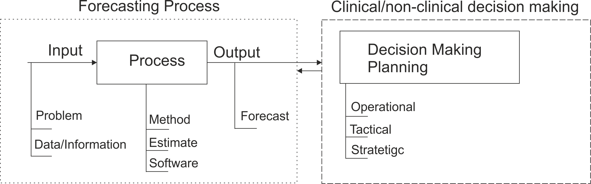
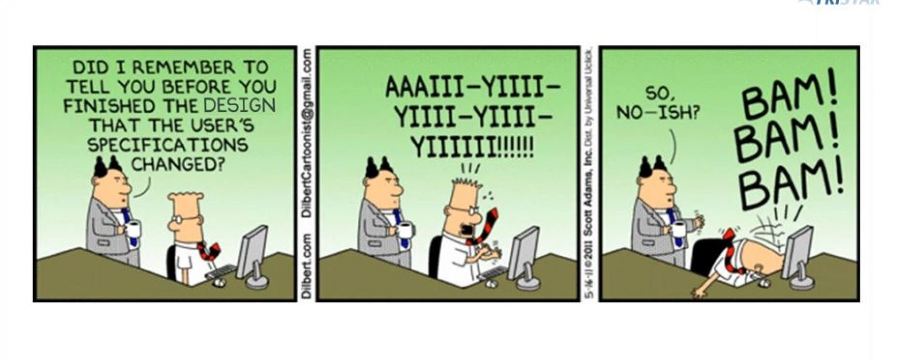

```{r setup, include=FALSE}
knitr::opts_chunk$set(echo = FALSE, cache = TRUE)
library(tidyverse)
library(fpp3)
library(readxl)
ausbeer <- as_tsibble(fpp2::ausbeer) %>%
  rename(Time = index, Production = value)
```

# Learning objectives

## Learning outcomes

You should be able to:

1. Describe the forecasting process
2. Identify what to forecast
3. Explain factors affecting forecastability
4. Understand ways to communicate forecast

# From decision making to forecasting

## Why do organisations need forecasting?

Why do you use forecast?

\pause

\fontsize{12}{13}\sf

| Forecasting required in many situation                | Forecast  |
| ----------------------------------------------------- |:---------:|
| Whether to build a new hospital in next 10 years?     |      ?    |
| How many staff does an A&E need next week?            |      ?    |
| How many units of bandages is reqired next month?     |      ?    |

- An important aid to planning and decision making
  * To inform decisions
  * To provide evidences

## Forecasting and decision making

- A forecast does not exist for its own purpose. There is at least one reason why we want a forecast, typically multiple reasons
- Most often the reason or reasons will make it adamantly clear what to forecast

```{r f_dm, fig.align='center', out.width="70%"}

```

## Tailor forecasting to decisions

- It has implications on how we generate forecast and how we measure its accuracy

```{r tailor_fcst, fig.align='center', out.width="100%"}

```

# Forecasting process

## Forecasting process

```{r forecasting_process1, fig.align='center'}

```

## Statistical forecasting steps

* **Step 1:** Problem definition- what to forecast?
* **Step 2:** Gathering information
* **Step 3:** Preliminary (exploratory) analysis
* **Step 4:** Choosing and fitting models
* **Step 5:** Evaluating and using a forecasting model

## What to forecast

- Forecast variable/s
- time granularity
- frequency
- horizon
- hierarchy/group granularity
  
## Gathering information

- Historical data/ time series

- Knowledge of any future events

    - Deterministic variables, e.g. holidays
    - Stochastic variables, e.g. temperature

- Collective judgement
- Expertise of key personnel

## Further considerations

- How much will the forecast cost?
- Is the model easy to understand?
- Accuracy requirements
- Quality of data
- Forecasting support system, software, ...

## A tidy forecasting workflow

The process of producing forecasts can be split up into a few fundamental steps.

1. Preparing data
2. Data visualisation
3. Specifying a model
4. Model estimation
5. Accuracy \& performance evaluation
6. Producing forecasts

## A tidy forecasting workflow

```{r workflow, echo = FALSE}
line_curve <- function(x, y, xend, yend, ...){
  geom_curve(
    aes(x = x, y = y, xend = xend, yend = yend),
    arrow = arrow(type = "closed", length = unit(0.03, "npc")),
    ...
  )
}

ggplot() +
  geom_text(
    aes(x = x, y = y, label = label),
    data = tribble(
      ~ x, ~ y, ~ label,
      1, 0, "Tidy",
      7/3, 0, "Visualise",
      3, 0.5, "Specify",
      11/3, 0, "Estimate",
      3, -0.5, "Evaluate",
      5, 0, "Forecast"
    ),
    size = 5
  ) +
  geom_segment(
    aes(x = x, y = y, xend = xend, yend = yend),
    data = tribble(
      ~ x, ~ y, ~ xend, ~ yend,
      1.3, 0, 1.9, 0,
      4.1, 0, 4.6, 0
    ),
    arrow = arrow(type = "closed", length = unit(0.03, "npc"))
  ) +
  line_curve(7/3, 0.1, 8/3, 0.5, angle = 250, curvature = -0.3) +
  line_curve(10/3, 0.5, 11/3, 0.1, angle = 250, curvature = -0.3) +
  line_curve(8/3, -0.5, 7/3, -0.1, angle = 250, curvature = -0.3) +
  line_curve(11/3, -0.1, 10/3, -0.5, angle = 250, curvature = -0.3) +
  theme_void() +
  xlim(0.8, 5.2) +
  ylim(-0.6, 0.6) +
  coord_equal(ratio = 1)
```

# What can be forecasted?

## Forecasting is difficult

\fullwidth{prediction_diff}

## What can we forecast?

\fullwidth{nasdaq-stock-market}

## What can we forecast?
 
\fullwidth{Forex2}

## What can we forecast?

\fullwidth{pills}

## What can we forecast?

\fullwidth{ae}

## What can we forecast?

\fullwidth{elecwires2}

## What can we forecast?

\fullheight{weatheruk}

## What can we forecast?

\fullwidth{ts22015}


## Which is easiest to forecast?

 1. daily electricity demand in 3 days time
 2. timing of next Halley's comet appearance
 3. time of sunrise this day next year
 4. Google stock price tomorrow
 5. Google stock price in 6 months time
 6. maximum temperature tomorrow
 7. exchange rate of \$US/AUS next week
 8. total sales of drugs in Australian pharmacies next month

## Factors affecting forecastability
\fontsize{13}{14}\sf
 - What makes something easy/difficult to forecast?
 
\pause
Something is easier to forecast if:

 - we have a good understanding of the factors that contribute to it
 - there is lots of data available;
 - the forecasts cannot affect the thing we are trying to forecast.
 - there is relatively low natural/unexplainable random variation.
 - the future is somewhat similar to the past


## Key step in forecasting

* Often in forecasting, a key step is knowing:
  * when something can be forecast accurately
  * when forecasts are no better than tossing a coin

* Good forecasting models capture the genuine patterns and relationships which exist in the historical data, but do not replicate past events that will not occur again.

## Forecasting situation and models

- Forecasting situations vary widely in their time horizons, factors determining actual outcomes, types of data patterns, and many other aspects; 
- The choice of model depends on data availability and forecast situation.

 |              |   No data  |   Past data   | Exogenous variable |
 |--------------|:----------:|:-------------:|:------------------:|
 | Judgemental  |      X     |               |                    |
 | Explanatory    |            |               |       X            |
 | Time series  |            |      X        |                    |

# Time series data and models

## What is a forecast?

Forecast: 

- an honest estimation of the future 
- based on all of the information available at the time when we generate the forecast

## Available data/information

1. Historical data/time series
2. Knowledge of any future events/variables
    + Deterministic variables
    + Stochastic variables
    + New information

## Time series data

* Time series consist of sequences of observations collected over time.
* We will assume the time periods are equally spaced.

    - Hourly patient attendance in a hospital
    - Daily average waiting time in A&E
    - Weekly calls in a Clinical Desk Service
    - Monthly consumption of cough medicine in NHS England
    
## What will happen next?

- `Time series forecasting` is estimating how the sequence of observations will continue into the future.

```{r forecasting, out.width="90%", fig.align='center'}
ausbeer %>% model(ETS(Production)) %>% forecast(h=20) %>% autoplot(tail(ausbeer, 60), level=NULL, alpha=.01)+
  geom_vline(xintercept = as.numeric(as.Date("2010-04-01")),col="red", linetype = "longdash")+
  labs(x ="Time",y="Observation",title = "Time series forecasting")
```

## Time Series forecasting models

- There are many different kinds of time series models:
    - Simple methods, e.g. naive
    - Exponential smoothing models
    - ARIMA
    - Regression
    - etc

# How to present forecast

## How to present forecasts?


- Point forecasts
- Prediction intervals
- Forecast as probability distribution

A forecast should acknowledge that the future is uncertain and provide information of that uncertainty.

## Random futures

```{r austa, echo=FALSE, include=FALSE, message=FALSE, warning=FALSE}
# Grab ABS data
library(patchwork)
austa <- readxl::read_excel("data/340101.xlsx", sheet = "Data1", skip = 9) |>
  rename(date = `Series ID`, value = A85375847A) |>
  select(date, value) |>
  transmute(
    Month = yearmonth(date),
    Visitors = value / 1e3
  ) |>
  bind_rows(tibble(
    Month = yearmonth(seq(as.Date("2021-11-01"), by = "1 month", length = 2)),
    Visitors = NA_real_
  )) |>
  as_tsibble(index = Month) |>
  filter(Month >= yearmonth("2000 Jan"))
# Fit ETS model
fit <- austa |>
  filter(Month < yearmonth("2018 Jan")) |>
  model(ETS(Visitors))
# Product forecasts
fc <- forecast(fit, h = 48) |>
  mutate(Month = as.Date(Month))
# Simulate 100 future sample paths
set.seed(1967)
sim <- fit |>
  generate(h = 48, times = 100) |>
  mutate(
    replicate = factor(.rep, levels = 1:100, labels = paste("Future", 1:100)),
    .rep = as.numeric(.rep)
  ) |>
  as_tibble() |>
  mutate(Month = as.Date(Month))
# Nice colors
cols <- scale_colour_manual(
  values = c("#D55E00", "#0072B2", "#009E73", "#CC79A7", "#E69F00", "#56B4E9", "#F0E442", sample(rainbow(93))),
  breaks = paste("Future", 1:100),
  name = " "
)
# Now build up some plots with alignment
p1 <- austa |>
  mutate(Visitors = if_else(Month >= yearmonth("2018 Jan"), NA_real_, Visitors)) |>
  as_tibble() |>
  mutate(Month = as.Date(Month)) |>
  ggplot(aes(x = Month, y = Visitors)) +
  geom_line() +
  labs(
    x = "Month",
    y = "Thousands of visitors",
    title = "Total short-term visitors to Australia"
  ) +
  scale_x_date(
    breaks = seq(as.Date("2000-01-01"), by = "5 years", l = 5),
    labels = paste("Jan", seq(2000, 2020, by = 5)),
    minor_breaks = seq(as.Date("2001-01-01"), by = "1 year", l = 25)
  ) +
  ylim(min(austa$Visitors, sim$.sim, na.rm = TRUE), max(austa$Visitors, sim$.sim, na.rm = TRUE))
p2 <- p1 + cols +
  geom_line(aes(y = .sim, group = replicate, colour = replicate),
    data = sim |> filter(.rep <= 1)
  )
p3 <- p1 + cols +
  geom_line(aes(y = .sim, group = replicate, colour = replicate),
    data = sim |> filter(.rep <= 2)
  )
p4 <- p1 + cols +
  geom_line(aes(y = .sim, group = replicate, colour = replicate),
    data = sim |> filter(.rep <= 3)
  )
p5 <- p1 + cols +
  geom_line(aes(y = .sim, group = replicate, colour = replicate),
    data = sim |> filter(.rep <= 10)
  )
p6 <- p1 + cols +
  geom_line(aes(y = .sim, group = replicate, colour = replicate), alpha = 0.5, data = sim) +
  guides(colour = "none")
p7 <- p1 +
  geom_line(aes(y = .sim, group = replicate, colour = replicate), alpha = 0.5, col = "gray", data = sim) +
  guides(colour = "none")
p8 <- p7 + autolayer(fc, level = c(50, 90))
p9 <- p8 + coord_cartesian(xlim = as.Date(c("2014-01-01", "2021-08-01"))) +
  scale_x_date(
    breaks = seq(as.Date("2000-01-01"), by = "2 years", l = 11),
    labels = paste("Jan", seq(2000, 2020, by = 2)),
    minor_breaks = seq(as.Date("2001-01-01"), by = "1 year", l = 25)
  )
aligned_plots <- align_patches(p1, p2, p3, p4, p5, p6, p7, p8, p9)
```

A forecast is an estimate of the probabilities of possible futures

```{r austa1, dependson="austa", echo=FALSE, warning=FALSE}
aligned_plots[[1]]
```

## Random futures

A forecast is an estimate of the probabilities of possible futures

```{r austa2, dependson='austa', echo=FALSE,warning=FALSE}
aligned_plots[[2]]
```


## Random futures

A forecast is an estimate of the probabilities of possible futures

```{r austa3, dependson='austa', echo=FALSE, warning=FALSE}
aligned_plots[[3]]
```


## Random futures

A forecast is an estimate of the probabilities of possible futures

```{r austa4, dependson='austa', echo=FALSE, warning=FALSE}
aligned_plots[[4]]
```


## Random futures

A forecast is an estimate of the probabilities of possible futures

```{r austa5, dependson='austa', echo=FALSE, warning=FALSE}
aligned_plots[[5]]
```


## Random futures

A forecast is an estimate of the probabilities of possible futures

```{r austa6, dependson='austa', echo=FALSE, warning=FALSE}
aligned_plots[[6]]
```


## Random futures

A forecast is an estimate of the probabilities of possible futures

```{r austa7, dependson='austa', echo=FALSE, warning=FALSE}
aligned_plots[[7]]
```


## Random futures

A forecast is an estimate of the probabilities of possible futures

```{r austa8, dependson='austa', echo=FALSE, warning=FALSE}
aligned_plots[[8]]
```


## Random futures

A forecast is an estimate of the probabilities of possible futures

```{r austa9, dependson='austa', echo=FALSE, warning=FALSE}
aligned_plots[[9]]
```


## Random futures

A forecast is an estimate of the probabilities of possible futures

```{r austa9b, dependson='austa', echo=FALSE, warning=FALSE}
aligned_plots[[9]] +
  geom_line(
    colour = "black",
    data = austa |> filter(Month >= yearmonth("2018 Jan")) |> mutate(Month = as.Date(Month))
  )
```


## Forecast as probability distribution

```{r fcast_dist}
  df <- data.frame(x=1:7, y=c(0.05, .30, .41, .10, .08, 0.04, .01))
    barplot(df$y, df$x, width = 5,space = 0, ylab="Probability", xlab="Observation", names.arg=c("40-49", "50-59", "60-69","70-79","80-89", "90-99","100-109"), legend.text = FALSE)
```


## Point forecasts

```{r p_fcst}
ausbeer %>% model(ETS(Production)) %>% forecast(h=20) %>% autoplot(tail(ausbeer, 60), level=NULL)+
  geom_vline(xintercept = as.numeric(as.Date("2010-04-01")),col="red", linetype = "longdash")+
  labs(x ="Time",y="Observation",title = "Time series forecasting")
```

## Prediction interval forecasts

```{r f_interval}
tail(ausbeer, 60) %>% model(ETS(Production)) %>% forecast(h=20) %>% 
autoplot(tail(ausbeer, 60), level=90)+
  geom_vline(xintercept = as.numeric(as.Date("2010-04-01")),col="red", linetype = "longdash")+
  labs(x ="Time",y="Observation",title = "Time series forecasting")+
  theme(legend.position = "")
```

## Statistical forecasting

- Thing to be forecast: $y_{T+h}$.
- What we know: $y_1,\dots,y_T$.
- Forecast distribution: ${y}_{T+h|t} = y_{T+h} \mid \{y_1,y_2,\dots,y_{T}\}$.
- Point forecast: $\hat{y}_{T+h|T} =\text{E}[y_{T+h} \mid y_1,\dots,y_T]$.
- Forecast variance: $\text{Var}[y_{t}  \mid y_1,\dots,y_T]$
- Prediction interval is a range of values of $y_{T+h}$ with high probability.


# Lab session 4
## Current situation in your organisation

Think about the forecasting process in your organisation:

- What do you forecast? 
  - variable
  - granularity
  - frequency
  - horizon
- How do you present forecasts?
- Do you need to adjuste statistical forecasts?
  - When and How you do it?

