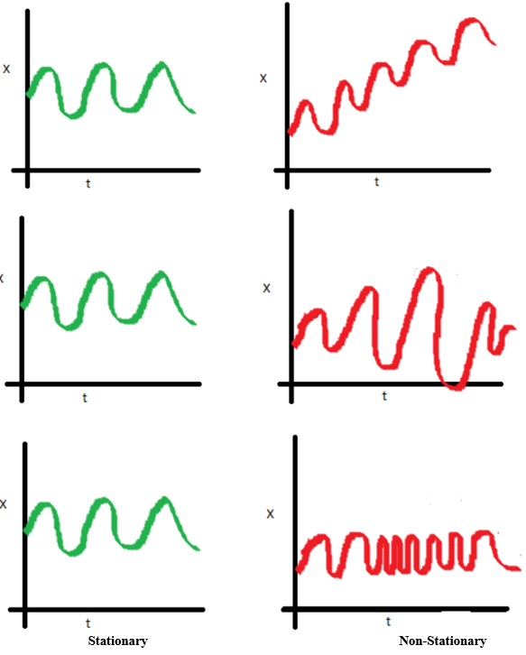

```{r setup, include=FALSE}
knitr::opts_chunk$set(echo = FALSE, cache=TRUE, warning=FALSE, message=FALSE)
options(digits=4, width=60)
library(tidyverse)
library(fable)
library(tsibble)
library(tsibbledata)
library(feasts)
library(lubridate)

usmelec <- as_tsibble(fpp2::usmelec) %>%
  rename(Month = index, Generation = value)

us_change <- read_csv("data/uschange.csv") %>%
  mutate(Time = yearquarter(Time)) %>%
  as_tsibble(index = Time)

eu_retail <- as_tsibble(fpp2::euretail)

h02 <- tsibbledata::PBS %>%
  filter(ATC2 == "H02") %>%
  summarise(Cost = sum(Cost))
```

# Learning objectives

## Learning objectives

* Describe model building strategy for ARIMA models
* Explain criteria for best model selection
* Produce forecast using ARIMA models

# Introduction to ARIMA models

## Exponential smoothing vs ARIMA models

- Exponential smoothing models were based on a description of trend and seasonality in the data, 
- ARIMA models aim to describe the autocorrelations in the data.
- Exponential smoothing and ARIMA models are the two most widely-used approaches to time series forecasting

## ARIMA models

\alert{Autoregressive Integrated Moving Average models}
\begin{tabular}{rl}
\textbf{AR}: & autoregressive (lagged observations as inputs)\\
\textbf{I}: & integrated (differencing to make series stationary)\\
\textbf{MA}: & moving average (lagged errors as inputs)
\end{tabular}

## ARIMA model

* Combine ARMA model with **differencing**.
* $(1-B)^d y_t$ follows an ARMA model.

\begin{block}{Autoregressive Moving Average(ARMA) models:}
\begin{align*}
  y_{t} &= c + \phi_{1}y_{t - 1} + \cdots + \phi_{p}y_{t - p} \\
        & \hspace*{2.4cm}\text{} + \theta_{1}\varepsilon_{t - 1} + \cdots + \theta_{q}\varepsilon_{t - q} + \varepsilon_{t}.
\end{align*}
\end{block}\pause

\fontsize{11}{12}\sf
\begin{block}{ARIMA($p, d, q$) model}
\begin{tabular}{rl}
AR:& $p =$ number of preceding/lagged $y$ values\\
I: & $d =$ number of times series have to be “differenced”\\
MA:& $q =$ number of preceding/lagged values for the error term .
\end{tabular}
\end{block}

## What does ARIMA account for?

- Previous observations 
- Rate of change in the previous observations 
- Error term in the previous observations 
- Perform weel for short term horizons

## Stationarity

 ARIMA models are stationary
 
\begin{block}{Definition}
If $\{y_t\}$ is a stationary time series, then for all $s$, the distribution of $(y_t,\dots,y_{t+s})$ does not depend on $t$.
\end{block}\pause

A **stationary series** is:

* roughly horizontal
* constant variance
* no patterns predictable in the long-term

##  Stationarity vs. Non-Stationarity

```{r, fig.align='center'}

```

## Stationary?

```{r}
as_tsibble(fma::eggs) %>% autoplot(value) + xlab("Year") + ylab("$") +
  ggtitle("Price of a dozen eggs in 1993 dollars")
```

## Stationary?

```{r}
aus_production %>% filter_index("1992" ~ .) %>%
  autoplot(Beer) + xlab("Year") + ylab("megalitres") +
  ggtitle("Australian quarterly beer production")
```

## Stationarity

\begin{block}{Definition}
If $\{y_t\}$ is a stationary time series, then for all $s$, the distribution of $(y_t,\dots,y_{t+s})$ does not depend on $t$.
\end{block}\pause\vspace*{0.4cm}

Transformations help to **stabilize the variance**.

For ARIMA modelling, we also need to **stabilize the mean**.

## Is your data stationarity?
\alert{Identifying non-stationary series}

* Time plot.
* The ACF of stationary data drops to zero relatively quickly
* The ACF of non-stationary data decreases slowly.
* For non-stationary data, the value of $r_1$ is often large and positive.

## Example: Google stock price

```{r}
google_2018 <- gafa_stock %>%
  filter(Symbol == "GOOG", year(Date) == 2018) %>%
  mutate(trading_day = row_number()) %>%
  update_tsibble(index = trading_day, regular = TRUE)
google_2018 %>%
  ACF(Close) %>% autoplot()
```

## Unit root tests

- One way to determine more objectively whether data is non stationary to use a unit root test
- These are statistical hypothesis tests of stationarity that are designed for determining whether differencing is required

\alert{Statistical tests to determine the required order of differencing.}

  * Kwiatkowski-Phillips-Schmidt-Shin (KPSS) test: null hypothesis is that the data are stationary

## KPSS test

```{r, echo=TRUE}
google_2018 %>%
  features(Close, unitroot_kpss)
```

## Differencing
\fontsize{13}{15}\sf

* Differencing helps to **stabilize the mean**.
* The differenced series is the *change* between each observation in the original series.
* Occasionally the differenced data will not appear stationary and it may be necessary to difference the data a second time.
* In practice, it is almost never necessary to go beyond second-order differences.

## Number of differencing

```{r, echo=TRUE}
google_2018 %>%
  features(Close, unitroot_ndiffs)
#seasonal differencing 
#features(Close, unitroot_nsdiffs)
```

# Non-seasonal ARIMA models

## Autoregressive models

\begin{block}{Autoregressive (AR) models:}
$$
  y_{t} = c + \phi_{1}y_{t - 1} + \phi_{2}y_{t - 2} + \cdots + \phi_{p}y_{t - p} + \varepsilon_{t},
$$
where $\varepsilon_t$ is white noise. We use \textbf{lagged values} of $y_t$ as predictors.
\end{block}

```{r arp, echo=FALSE, fig.height=3}
set.seed(1)
p1 <- tsibble(idx = seq_len(100), sim = 10 + arima.sim(list(ar = -0.8), n = 100), index = idx) %>%
  autoplot(sim) + ylab("") + ggtitle("AR(1)")
p2 <- tsibble(idx = seq_len(100), sim = 20 + arima.sim(list(ar = c(1.3, -0.7)), n = 100), index = idx) %>%
  autoplot(sim) + ylab("") + ggtitle("AR(2)")
gridExtra::grid.arrange(p1,p2,nrow=1)
```

## Autoregressive models

- In an autoregression model, we forecast the variable of interest using a linear combination of past values of the variable. 
- Where $c$ is a constant and $e_t$ i.i.d. (white noise) random variable with zero mean and known variance, $\sigma^2$.  
- Changing the parameters $\phi_{1},\phi_{2},\dots, \phi_{p}$ results in different time series patterns.

## Moving Average (MA) models

\begin{block}{Moving Average (MA) models:}
$$
  y_{t} = c + \varepsilon_t + \theta_{1}\varepsilon_{t - 1} + \theta_{2}\varepsilon_{t - 2} + \cdots + \theta_{q}\varepsilon_{t - q},
$$
where $\varepsilon_t$ is white noise.

We use \textbf{past \emph{errors}} as predictors. 
\emph{Don't confuse this with moving average smoothing!}
\end{block}

```{r maq, fig.height=2.5}
set.seed(2)
p1 <- tsibble(idx = seq_len(100), sim = 20 + arima.sim(list(ma = 0.8), n = 100), index = idx) %>%
  autoplot(sim) + ylab("") + ggtitle("MA(1)")
p2 <- tsibble(idx = seq_len(100), sim = arima.sim(list(ma = c(-1, +0.8)), n = 100), index = idx) %>%
  autoplot(sim) + ylab("") + ggtitle("MA(2)")

gridExtra::grid.arrange(p1,p2,nrow=1)
```

## Moving Average (MA) models

- We forecast the variable of interest using a linear combination of \textbf{past \emph{errors}}
- $c$ is a constant and $e_t$ i.i.d. (white noise) random variable with zero mean and known variance, $\sigma^2$.  
- Changing the parameters $\theta_{1},\theta_{2},\dots, \theta_{q}$ results in different time series patterns.

## ARMA(p,q) models

\begin{block}{Autoregressive Moving Average(ARMA) models:}
\begin{align*}
  y_{t} &= c + \phi_{1}y_{t - 1} + \cdots + \phi_{p}y_{t - p} \\
        & \hspace*{2.4cm}\text{} + \theta_{1}\varepsilon_{t - 1} + \cdots + \theta_{q}\varepsilon_{t - q} + \varepsilon_{t}.
\end{align*}
\end{block}

* Predictors include both **lagged values of $y_t$ and lagged errors.**
* Conditions on coefficients ensure stationarity.
* Conditions on coefficients ensure invertibility.

# Estimation and order selection

## Select order of p,d,q

* Once you have a stationary time series, the next step is to select the appropriate ARIMA model. 
      - Number of differencing determine $d$
*  This means finding the most appropriate values for $p$ and $q$ in the $
ARIMA($p,d,q$) model.
* To do so, you need to examine the Autocorrelation and  Partial Autocorrelation of the stationary time series.

## Partial autocorrelations

\fontsize{13}{14}\sf

\alert{Partial autocorrelations} measure relationship\newline between $y_{t}$ and $y_{t - k}$, when the effects of other time lags --- $1, 2, 3, \dots, k - 1$ --- are removed.\pause
\begin{block}{}
\begin{align*}
\alpha_k &= \text{$k$th partial autocorrelation coefficient}\\
         &= \text{equal to the estimate of $\phi_k$ in regression:}\\
         & \hspace*{0.8cm} y_t = c + \phi_1 y_{t-1} + \phi_2 y_{t-2} + \dots + \phi_k y_{t-k}.
\end{align*}
\end{block}\pause

* Varying number of terms on RHS gives $\alpha_k$ for different values of $k$.
* There are more efficient ways of calculating $\alpha_k$.
* $\alpha_1=\rho_1$
* same critical values of $\pm 1.96/\sqrt{T}$ as for ACF.

## ACF and PACF interpretation

**AR(1)**
\begin{align*}
\hspace*{1cm}
  \rho_k &= \phi_1^k\qquad\text{for $k=1,2,\dots$};\\
\alpha_1 &= \phi_1 \qquad\alpha_k = 0\qquad\text{for $k=2,3,\dots$}.
\end{align*}

So we have an AR(1) model when

  * autocorrelations exponentially decay
  * there is a single significant partial autocorrelation.

<!-- ## ACF and PACF interpretation -->

<!-- **AR($p$)** -->

<!--   * ACF dies out in an exponential or damped sine-wave manner -->
<!--   * PACF has all zero spikes beyond the $p$th spike -->

<!-- So we have an AR($p$) model when -->

<!--   * the ACF is exponentially decaying or sinusoidal -->
<!--   * there is a significant spike at lag $p$ in PACF, but none beyond $p$ -->

## ACF and PACF interpretation

**MA(1)**
\begin{align*}
\hspace*{1cm}\rho_1 &= \theta_1\qquad \rho_k = 0\qquad\text{for $k=2,3,\dots$};\\
\alpha_k &= -(-\theta_1)^k
\end{align*}

So we have an MA(1) model when

 * the PACF is exponentially decaying and
 * there is a single significant spike in ACF

<!-- ## ACF and PACF interpretation -->

<!-- **MA($q$)** -->

<!--  * PACF dies out in an exponential or damped sine-wave manner -->
<!--  * ACF has all zero spikes beyond the $q$th spike -->

<!-- So we have an MA($q$) model when -->

<!--   * the PACF is exponentially decaying or sinusoidal -->
<!--   * there is a significant spike at lag $q$ in ACF, but none beyond $q$ -->

## Example: Mink trapping

```{r}
mink <- as_tsibble(fma::mink)
mink %>% autoplot(value) +
  xlab("Year") +
  ylab("Minks trapped (thousands)") +
  ggtitle("Annual number of minks trapped")
```

## Example: Mink trapping

```{r}
p1 <- mink %>% ACF(value) %>% autoplot()
p2 <- mink %>% PACF(value) %>% autoplot()
gridExtra::grid.arrange(p1,p2,nrow=1)
```

## Maximum likelihood estimation

Having identified the model order, we need to estimate the parameters $c$, $\phi_1,\dots,\phi_p$, $\theta_1,\dots,\theta_q$.\pause

* MLE is very similar to least squares estimation obtained by minimizing
$$
  \sum_{t-1}^T e_t^2
$$

<!-- * The `ARIMA()` model allows LS or MLE estimation. -->
<!-- * Non-linear optimization must be used in either case. -->
<!-- * Different software will give different estimates. -->

## Information criteria

\alert{Akaike's Information Criterion (AIC):}
\centerline{$\text{AIC} = -2 \log(L) + 2(p+q+k+1),$}
where $L$ is the likelihood of the data,\newline
$k=1$ if $c\ne0$ and $k=0$ if $c=0$.\pause\vspace*{0.2cm}

\alert{Corrected AIC:}
\centerline{$\text{AICc} = \text{AIC} + \frac{2(p+q+k+1)(p+q+k+2)}{T-p-q-k-2}.$}\pause\vspace*{0.2cm}

\alert{Bayesian Information Criterion:}
\centerline{$\text{BIC} = \text{AIC} + [\log(T)-2](p+q+k-1).$}
\pause\vspace*{-0.2cm}
\begin{block}{}Good models are obtained by minimizing either the AIC, \text{AICc}\ or BIC\@. Our preference is to use the \text{AICc}.\end{block}

# ARIMA modelling in R

## How does ARIMA() work?

\begin{block}{A non-seasonal ARIMA process}
\[
\phi(B)(1-B)^dy_{t} = c + \theta(B)\varepsilon_t
\]
Need to select appropriate orders: \alert{$p,q, d$}
\end{block}

\alert{Hyndman and Khandakar (JSS, 2008) algorithm:}

  * Select no.\ differences \alert{$d$} and \alert{$D$} via KPSS test and seasonal strength measure.
  * Select \alert{$p,q$} by minimising AICc.
  * Use stepwise search to traverse model space.

## How does ARIMA() work?
\fontsize{12}{12}\sf

\begin{block}{}
\centerline{$\text{AICc} = -2 \log(L) + 2(p+q+k+1)\left[1 +
\frac{(p+q+k+2)}{T-p-q-k-2}\right].$}
where $L$ is the maximised likelihood fitted to the \textit{differenced} data,
$k=1$ if $c\neq 0$ and $k=0$ otherwise.
\end{block}\pause

Step1:
: Select current model (with smallest AICc) from:\newline
ARIMA$(2,d,2)$\newline
ARIMA$(0,d,0)$\newline
ARIMA$(1,d,0)$\newline
ARIMA$(0,d,1)$
\pause\vspace*{-0.1cm}

Step 2:
: Consider variations of current model:

    * vary one of $p,q,$ from current model by $\pm1$;
    * $p,q$ both vary from current model by $\pm1$;
    * Include/exclude $c$ from current model.

  Model with lowest AICc becomes current model.

\alert{Repeat Step 2 until no lower AICc can be found.}

## Modelling procedure with `ARIMA`
\fontsize{12}{13}\sf

1. Plot the data. Identify any unusual observations.
2. If necessary, transform the data (using a Box-Cox transformation) to stabilize the variance.
3. If the data are non-stationary: take first differences of the data until the data are stationary.
4. Examine the ACF/PACF: Is an AR($p$) or MA($q$) model appropriate?
5. Try your chosen model(s), and use the \text{AICc} to search for a better model.
6. Check the residuals from your chosen model by plotting the ACF of the residuals, and doing a portmanteau test of the residuals. If they do not look like white noise, try a modified model.
7. Once the residuals look like white noise, calculate forecasts.

## Automatic modelling procedure with `ARIMA`
\fontsize{12}{13}\sf

1. Plot the data. Identify any unusual observations.
2. If necessary, transform the data (using a Box-Cox transformation) to stabilize the variance.
3. Use `ARIMA` to automatically select a model.
4. Check the residuals from your chosen model by plotting the ACF of the residuals, and doing a portmanteau test of the residuals. If they do not look like white noise, try a modified model.
5. Once the residuals look like white noise, calculate forecasts.

# Forecasting

## Point forecasts

1. Rearrange ARIMA equation so $y_t$ is on LHS.
2. Rewrite equation by replacing $t$ by $T+h$.
3. On RHS, replace future observations by their forecasts, future errors by zero, and past errors by corresponding residuals.

Start with $h=1$. Repeat for $h=2,3,\dots$.

## Prediction intervals

\begin{block}{95\% prediction interval}
$$\hat{y}_{T+h|T} \pm 1.96\sqrt{v_{T+h|T}}$$
where $v_{T+h|T}$ is estimated forecast variance.
\end{block}

* Multi-step prediction intervals for ARIMA(0,0,$q$):
\centerline{$\displaystyle y_t = \varepsilon_t + \sum_{i=1}^q \theta_i \varepsilon_{t-i}.$}
\centerline{$\displaystyle
v_{T|T+h} = \hat{\sigma}^2 \left[ 1 + \sum_{i=1}^{h-1} \theta_i^2\right], \qquad\text{for~} h=2,3,\dots.$}

<!-- \pause -->

<!-- * AR(1): Rewrite as MA($\infty$) and use above result. -->
<!-- * Other models beyond scope of this subject. -->

<!-- ## Prediction intervals -->

<!-- * Prediction intervals **increase in size with forecast horizon**. -->
<!-- * Prediction intervals can be difficult to calculate by hand -->
<!-- * Calculations assume residuals are **uncorrelated** and **normally distributed**. -->
<!-- * Prediction intervals tend to be too narrow. -->
<!--     * the uncertainty in the parameter estimates has not been accounted for. -->
<!--     * the ARIMA model assumes historical patterns will not change during the forecast period. -->
<!--     * the ARIMA model assumes uncorrelated future \rlap{errors} -->

# Seasonal ARIMA models

## Seasonal ARIMA models

| ARIMA | $~\underbrace{(p, d, q)}$ | $\underbrace{(P, D, Q)_{m}}$ |
| ----: | :-----------------------: | :--------------------------: |
|       | ${\uparrow}$              | ${\uparrow}$                 |
|       | Non-seasonal part         | Seasonal part of             |
|       | of the model              | of the model                 |

where $m =$ number of observations per year.

<!-- ## Seasonal ARIMA models -->

<!-- E.g., ARIMA$(1, 1, 1)(1, 1, 1)_{4}$ model (without constant)\pause -->
<!-- $$(1 - \phi_{1}B)(1 - \Phi_{1}B^{4}) (1 - B) (1 - B^{4})y_{t} ~= ~ -->
<!-- (1 + \theta_{1}B) (1 + \Theta_{1}B^{4})\varepsilon_{t}. -->
<!-- $$\pause -->

<!-- \setlength{\unitlength}{1mm} -->
<!-- \begin{footnotesize} -->
<!-- \begin{picture}(100,25)(-5,0) -->
<!-- \thinlines -->
<!-- {\put(5,22){\vector(0,1){6}}} -->
<!-- {\put(22,10){\vector(0,1){18}}} -->
<!-- {\put(38,22){\vector(0,1){6}}} -->
<!-- {\put(52,10){\vector(0,1){18}}} -->
<!-- {\put(77,22){\vector(0,1){6}}} -->
<!-- {\put(95,10){\vector(0,1){18}}} -->
<!-- {\put(-10,17){$\left(\begin{array}{@{}c@{}} \text{Non-seasonal} \\ \text{AR(1)} -->
<!--                     \end{array}\right)$}} -->
<!-- {\put(12,5){$\left(\begin{array}{@{}c@{}} \text{Seasonal} \\ \text{AR(1)} -->
<!--                     \end{array}\right)$}} -->
<!-- {\put(25,17){$\left(\begin{array}{@{}c@{}} \text{Non-seasonal} \\ \text{difference} -->
<!--                     \end{array}\right)$}} -->
<!-- {\put(40,5){$\left(\begin{array}{@{}c@{}} \text{Seasonal} \\ \text{difference} -->
<!--                     \end{array}\right)$}} -->
<!-- {\put(65,17){$\left(\begin{array}{@{}c@{}} \text{Non-seasonal} \\ \text{MA(1)} -->
<!--                     \end{array}\right)$}} -->
<!-- {\put(85,5){$\left(\begin{array}{@{}c@{}} \text{Seasonal} \\ \text{MA(1)} -->
<!--                     \end{array}\right)$}} -->
<!-- \end{picture} -->
<!-- \end{footnotesize} -->

<!-- \vspace*{10cm} -->

## Seasonal ARIMA models
The seasonal part of an AR or MA model will be seen in the seasonal lags of
the PACF and ACF.

\alert{ARIMA(0,0,0)(0,0,1)$_{12}$ will show:}

  * a spike at lag 12 in the ACF but no other significant spikes.
  * The PACF will show exponential decay in the seasonal lags; that is, at lags 12, 24, 36, \dots.

\alert{ARIMA(0,0,0)(1,0,0)$_{12}$ will show:}

  * exponential decay in the seasonal lags of the ACF
  * a single significant spike at lag 12 in the PACF.

## European quarterly retail trade

```{r, echo=TRUE, fig.height=3.6}
eu_retail %>% autoplot(value) +
  xlab("Year") + ylab("Retail index")
```

## European quarterly retail trade
\fontsize{11}{12}\sf

```{r, echo=TRUE, fig.height=4}
eu_retail %>% gg_tsdisplay(
  value %>% difference(4))
```

## European quarterly retail trade
\fontsize{11}{12}\sf

```{r, echo=TRUE, fig.height=3.8}
eu_retail %>% gg_tsdisplay(
  value %>% difference(4) %>% difference(1))
```

## European quarterly retail trade

  * $d=1$ and $D=1$ seems necessary.
  * Significant spike at lag 1 in ACF suggests non-seasonal MA(1) component.
  * Significant spike at lag 4 in ACF suggests seasonal MA(1) component.
  * Initial candidate model: ARIMA(0,1,1)(0,1,1)$_4$.
  * We could also have started with ARIMA(1,1,0)(1,1,0)$_4$.

## European quarterly retail trade
\fontsize{11}{12}

```{r, echo=TRUE, fig.height=3.5}
fit <- eu_retail %>%
  model(arima = ARIMA(value ~ pdq(0,1,1) + PDQ(0,1,1)),
        auto_arima = ARIMA(value))
fit %>% report()
fit %>% select(arima) |> gg_tsresiduals()
```

## European quarterly retail trade
\fontsize{11}{12}\sf

```{r, echo = TRUE}
augment(fit) %>%
  features(.resid, ljung_box, lag = 8, dof = 2)
```

# Lab Session 8
## Lab Session 8

For the daily A&E time series:

 * Fit the optimal ARIMA model.
 * Produce forecasts of your fitted models for 42 days.
 * specify the order of p,q,P,Q manually to compare with the optimal ARIMA
 * Check the forecasts. Do they look reasonable?